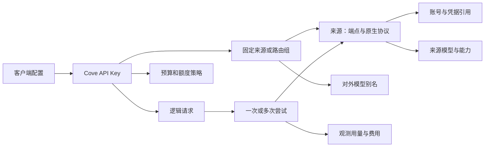

# Cove · 栖港：完整产品与技术 Spec

版本：1.2 外部适配补充稿 · 2026-09-30 交付 · 2026-09-29 代码快照

状态：**104项需求、输入和验收保持完整；v1.2逐一补充11项外部适配卡、固定源码、配置及恢复样例。仍有独立授权准入、私有成功wire和客户端自动写入口未闭合，不能称全部适配已就绪。实现与真实验收另计。**

## 0. 文档合同与阅读顺序

这是从当前 Cove 实现、原 Spec、三协议补充和竞品调查收敛出的目标规格。它覆盖个人网关完整产品范围，优先级只安排实现依赖，不把后续能力从需求中删除。

- 本文是目标行为的唯一规范；`02-IMPLEMENTATION-AND-COMPETITOR-REVIEW.md` 是实现证据与竞品分析，不反向定义产品承诺。
- [外部适配合同](03-EXTERNAL-ADAPTER-CONTRACTS.md)是第27、30、31、36节的规范附件；[合成样例](adapter-fixtures.json)不代表真实录包或执行结果。
- 附录需求台账的每一行都有编号、当前状态、目标行为、优先级和验收；`requirements.tsv` 是同一台账的机器可读版本。
- `old-spec-coverage.tsv` 逐项处理原 A01—A45。被修改的旧约束说明替代合同，不以删除验收来掩盖缺口。
- 当前实现位于 `/Users/lifcc/Desktop/code/AI/tools/gatt`。本轮工作目录也是该Cove产品库；前一轮工作目录 `litellm-rs` 仅为历史上下文。Cove 不依赖 LiteLLM、litellm-rs 或 CLIProxyAPI 核心运行。
- 本文沿用 Go + React + SQLite，不发起 Rust 重写。使用 architecture-foundation 核对边界、状态、失败路径与验收；OpenAI 合同使用 openai-docs 核对。
- “实现存在”只证明有代码路径；“模拟通过”只证明测试条件下的结果；“真实验证”须有指定客户端、账号、模型、构建和调用证据。三者不能互换。
- 当前仓库无提交、无 remote，无可映射的现有 issue/PR；这里的工作包不是已经创建的 GitHub issue。

### 0.1 本文明确替换的旧决策

| 旧决策或历史文档表述 | 新目标 |
|---|---|
| 只做 Responses；Chat/Messages 是补充 | 三协议作为同一产品核心，协议能力矩阵与共同执行链一起交付 |
| 每 Key 固定单来源、永不切换 | 固定来源与显式路由组均支持；有状态请求仍固定身份 |
| 每请求永远一次尝试 | 默认一次；符合明确条件的路由可有限尝试；每次尝试独立计量 |
| 手填模型就等于模型可用 | 发现、配置、可路由、真实验证四个维度分开 |
| Messages/Codex 因 max_tokens 不兼容而长期关闭 | 实现明确披露的订阅兼容路径并做真实客户端验收；硬限制语义不伪造 |
| 所有账号额度永久未知 | 有可靠接口时获取窗口额度；无接口时明确未知并显示原因 |
| 管理密码、启动票据是必经入口 | 按用户已确定的选择，本机网页自动建立会话，无管理密码步骤 |
| 首版不做调度、预算、自动配置 | 完整需求保留，按依赖交付，不能把未实现写成“不需要” |

## 1. 产品定义与用户结果

### 1.1 目标

用户在自己电脑或自己管理的单用户主机上运行 Cove，用自己的 API 凭据或独立授权的订阅账号，生成 Cove 客户端 API Key，供 Codex、Claude Code、Gemini CLI、OpenCode、编辑器插件和普通 SDK 调用。Cove 管理来源、模型、账号状态、路由、访问权限、额度、用量、费用与接入配置。

“面向个人用户的产品”意味着每个用户可安装和管理自己的实例。将来收费发行客户端，与替用户托管所有账号、销售上游额度是不同部署合同；本规格不自动引入多租户服务架构。

### 1.2 必须完成的用户旅程

1. 安装、启动，网页直达控制台；看见真实服务版本和就绪状态。
2. 添加 API 来源，或点击“使用 ChatGPT 登录”，完成 Cove 自己的 OAuth 授权。
3. 发现模型、选模型，完成文本和工具调用验证；知道哪些协议可以使用。
4. 进入始终可见的 **API Keys** 页面，创建 Key，复制 Key、Base URL、模型和协议示例。
5. 接入选定客户端；先成功显示文本，再执行一次真实工具，再把工具结果送回模型完成第二轮。
6. 在 Cove 中找到该客户端、模型、账号、每次尝试、耗时与用量；知道失败在哪一层。
7. 多账号或多来源时，设置路由、优先级、权重、并发、冷却和预算；看到实际选择理由。
8. 额度用完、刷新失败、取消、断线、配置冲突时，系统给出可操作恢复路径。
9. 恢复客户端原配置、重启 Cove、备份与恢复；原有独立登录和非 Cove 配置可继续使用。

### 1.3 范围边界不等于遗漏

| 能力族 | 处理 |
|---|---|
| 个人调用核心、三协议、Codex 登录、模型、Key、日志、真实工具循环 | P0 必交付 |
| 账号池、调度、预算、额度、自动配置与恢复、完整诊断 | P1 必交付；属于完整产品 |
| 更多订阅适配、Gemini 原生、图像/音频/文件/向量/重排、WS/compact、后台服务、升级 | P2 有明确合同和独立验收，未完成不得宣称全功能版 |
| MCP/Skills 配置、项目级接入 | 作为客户端配置扩展纳入 P2；不在网关内执行任意本地工具 |
| 团队 RBAC、租户隔离、充值/分销/邀请返利、公共中转站 | 已检查的相邻产品能力，当前单用户产品不实现；如产品目标改为托管多人服务，须另立部署与账务规格 |
| 聊天客户端、Agent 执行器、训练平台、任意插件市场 | 不属于当前个人网关职责；可对接外部产品 |

## 2. 当前实现基线与真实缺口

代码快照和 SHA-256 见 `implementation-manifest.json`，源码副本在 `implementation/`，不含真实凭据和数据库。

| 领域 | 当前代码可证明 | 距目标的缺口 |
|---|---|---|
| 启动 | Go HTTP、固定 loopback、数据目录锁、SQLite、嵌入前端 | 平台安装、后台托管、升级、就绪与存储健康分离 |
| 来源 | `api_key` / `codex_subscription` 两种；版本与绑定 generation | provider/原生协议区分、代理、多账号关系、模型自动发现 |
| 订阅 | 独立浏览器 OAuth、PKCE/state/nonce、签名身份检查、刷新 singleflight、退出 | 当前用户真实成功未证明；更多订阅；额度接口 |
| Key | 创建、一次显示、列表、撤销、改名接口、切来源 | 到期、模型/协议权限、预算/限流/并发、轮换、路由绑定 |
| 协议 | Responses；Chat/Messages 转到 Responses；有限文本函数工具 | 原生 Messages/Chat 上游、三协议完整工具客户端、Codex Messages、多模态 |
| 模型 | 手填 ID、`GET /v1/models`、单模型文本测试 | 发现、别名、按模型能力/价格/上下文、测试档案 |
| 调度 | 全局并发槽、固定单来源、一次上游 POST | 池、健康/冷却、有限重试、亲和、逐尝试记录 |
| 用量 | 可空 token、部分费用、币种分开、历史价格快照 | 预算预留与结算、账号额度、模型价格、聚合性能 |
| 接入 | 三协议 curl、Codex 独立目录启动命令、手动恢复说明 | 自动检测、配置预览、原子写入与三方恢复、更多工具 |
| UI | 来源/API Keys/请求/用量/设置 | 模型/路由/工具独立页面、能力选择、预算额度图表和完整异常状态 |

最近同会话独立检查中，运行中前端已含 API Key 创建入口；32 个顶层聚焦测试在独立副本中带 race 通过。这不等于全部测试通过，也不等于真实订阅通过。最近读取的运行数据只有失败调用、Codex 来源已退出；本轮没有替用户登录、创建 Key、调用收费模型或重启服务。详细时间与构建证据见第二份文档。

## 3. 产品对象与状态归属

### 3.1 关系模型



账号是一套由 Cove 持有的身份/凭据；来源是一次可调用的 provider 端点和账号绑定。多个来源若确实共用同一份刷新凭据，必须引用同一 account_id，由一个刷新 owner 管理，不能复制 refresh token 建立多个竞争 owner。简单用户旅程仍可“一次添加来源，同时建立账号”；数据归属分开不要求多一步界面。

| 状态 | 唯一事实来源 | 内存投影及失效方式 |
|---|---|---|
| 账号身份/认证状态/credential_ref/generation | SQLite accounts | account runtime 只缓存当前 generation；替换/退出后旧任务不能提交 |
| access/refresh/API secret | 私有凭据文件，DB 只保存随机引用 | FileSecrets 单 writer；持久化不确定则停止凭据读写 |
| 来源、模型、别名、路由、Key 权限、价格 | SQLite | 请求获得版本快照；修改提交后再发布缓存 |
| 运行请求、槽位、等待队列、冷却计时 | App runtime | 重启不重放请求；必要的 cooldown_until 持久化 |
| 尝试与用量、预算预留/结算 | SQLite 同一事务边界 | UI/报表仅查询或可重建聚合 |
| 客户端配置 | 客户端实际文件 | Cove 保存本次字段修改记录与 hash，不宣称独占文件 |
| provider 能力与参数规则 | 适配器代码及经验证的 capability 记录 | 不由 UI 私自推断；规则版本更新令相应验证过期 |
| 账号剩余额度 | provider 最近观测 | 记录 observed_at/expires_at，过期显示陈旧，未知不是零 |

### 3.2 状态必须正交

- `auth_state`：not_configured、authorizing、ready、refreshing、needs_reauth、logged_out。
- `enabled`：用户允许新请求，独立于认证状态。
- `call_health`：unknown、healthy、degraded、cooldown；带最近成功/错误与冷却原因。
- `quota_state`：unknown、available、exhausted、stale、unsupported；每个窗口独立。
- `verification`：untested、passed、failed、stale，绑定来源/账号 generation、模型、入口协议、特性、客户端版本、适配器版本。
- `request`：admitted、queued、dispatching、streaming、completed、failed、cancelled、interrupted、unverified。
- 每请求还单列 `upstream_result`、`delivery_result`、`observation_completeness`。HTTP 200 不推导 completed；客户端断开不抹掉上游已观测用量。

## 4. 架构和副作用边界

### 4.1 选择

单进程 Go 服务 + SQLite + 私有凭据文件 + React Web UI。先完成已有执行链边界，再按确实独立的 IO 和测试责任拆包；不需要微服务、Redis、消息总线或运行时插件框架。

当前 `internal/app` 同时负责 HTTP、业务、存储和 provider。新增功能遵循下表，可先按文件分工逐步形成 `gateway`、`provider`、`store`、`clientconfig` 边界，不能仅新增接口而保留另一条旧派发通路。

| 边界 | owner 与输入/输出 | 允许依赖/副作用 | 禁止 | 验收入口 |
|---|---|---|---|---|
| App 生命周期 | 启停、配置版本、任务句柄、取消、关闭屏障 | 调用所有具体适配器；短锁发布状态 | 持锁做网络/长文件 IO | TestShutdownDrainsOwnedTasks |
| 管理 HTTP | 解码命令、管理会话、错误映射 | 调用应用用例 | 自己刷新 token 或执行模型请求 | TestAdminBoundaryAndSecretIsolation |
| 数据 HTTP | Key 认证、前置容量、入口协议解析、流写出 | 调用唯一 Executor | 每个协议各自做账/重试 | TestProtocolEntrySharesExecution |
| 协议转换 | 结构化输入/事件 → 对端结构 | 纯转换；有界每请求状态 | 读 secrets、选账号、HTTP、SQL | TestSpecProtocolMatrix（新增） |
| 路由决策 | 权限/模型能力/状态快照 → 有序候选+理由 | 纯选择；运行时 owner 执行槽位分配 | 修改账号身份、重放请求正文 | TestSpecRouting（新增） |
| Executor | 一次逻辑请求/多个明确尝试 | 调度、provider IO、记录、取消 | 在已输出后切账号；吞错伪造成功 | TestSpecAttemptSafety（新增） |
| AccountManager | 授权/刷新/退出，唯一凭据发布 | OAuth/identity/secret/DB；generation CAS | 客户端 Key 当作 provider 凭据 | TestConcurrentRefreshAndUnknownRotation |
| Provider adapter | endpoint/auth/capabilities/请求构建/用量/错误/额度 | provider 网络由 executor/account owner 发起 | 写 Key/预算、全局 goroutine、自定义旁路重试 | TestSpecProviderContracts（新增） |
| Store/Accounting | 事务、查询、预留与结算 | SQLite | 网络、直接发 UI 事件、解释协议内容 | TestSpecAccounting（新增） |
| ClientConfig | preview/apply/restore，平台进程启动 | 受选定目标约束的文件/OS IO | 扫描或覆盖未选择的登录信息 | TestSpecClientConfig（新增） |
| Web UI | 用户意图与结果展示 | 管理 API、可撤销的本地视图状态 | 持久保存上游 secret、自己判定支持矩阵 | spec-onboarding.e2e（新增） |

### 4.2 生命周期

启动：解析配置 → 绑定端口/数据锁 → 验证私有目录 → 打开 DB 并检查 schema 版本 → 初始化 secret store → 崩溃记录恢复 → 建立 transport/运行状态 → 注册管理和数据路由 → 就绪 → 启动有 owner 的维护任务。

失败按相反顺序清理。`/healthz` 只说明进程存活；新增 `/readyz` 必须检查 admission、DB/secret 故障锁和初始化是否完成，失败返回 503。不能用固定 `{status:ok}` 代表可调用。

关闭：停止新请求和配置写入 → 停止维护/OAuth/刷新入口 → 在宽限期内让运行请求结束 → 取消剩余请求并解除阻塞读写 → 等待全部 owned tasks → flush/close store 与 transport → 释放目录锁。超时要退出失败并保留 interrupted 恢复，不提前关闭仍被使用的 DB。

### 4.3 配置与变更语义

- 启动配置：listen、data_dir、HTTP 总体上限/超时、可信 provider endpoint、平台启动方式。改变后重启。
- 运行配置：sources/accounts/models/routes/keys/prices/budgets/retention。版本控制，成功持久化后对新请求生效。
- 在途请求使用已准入快照。停用、撤销默认阻止新请求；“同时终止运行请求”是单独明确动作。账号切换前展示在途数量，不把旧结果归属新账号。
- 标记冷却或错误不修改用户的 enabled；修复认证不自动扩大 Key 权限。
- 标量热配置集中在一个 owner 发布；禁止 UI、config 文件、数据库各自维护同名可写值。

## 5. 来源、账号与凭据完整合同

### 5.1 来源种类

| 目标适配 | 认证 | 原生端点/协议 | 交付级别 |
|---|---|---|---|
| OpenAI API / 明确支持 Responses 的兼容服务 | API Key | Responses；其他端点逐项发现/配置 | P0 |
| 只支持 Chat Completions 的兼容服务 | API Key | Chat | P0，不能强发 `/responses` |
| Anthropic API | API Key | Messages/count_tokens | P0 原生Messages；count_tokens P1；普通API成功不能代替Codex订阅验收 |
| Gemini API | API Key | generateContent/streamGenerateContent | P2 |
| Codex/ChatGPT 订阅 | Cove 独立 OAuth | provider 专用 Responses transport | P0 必须真实通过 |
| 其他订阅：Claude、Gemini CLI/Antigravity、Copilot、Qwen、Grok 等 | 各自实际授权方式 | 每适配器独立能力卡 | P2 逐个验证，不能由“OAuth 都一样”推导支持 |
| Ollama 等本地服务 | 可无上游认证 | 本地原生或其兼容端点 | P2；客户端仍使用 Cove Key |
| Azure、Bedrock、Vertex 等云服务 | 特定 endpoint/签名/环境身份 | 服务特定适配 | P2 扩展，凭据与区域配置要实测；不套用通用 Bearer |

可配置 base_url 不代表任意 provider 已支持。名称、认证方式、原生协议、支持端点、模型映射必须在来源详情明确展示。除 Codex 已有路径外，表中未有当前代码的适配均是目标。

### 5.2 API 凭据

创建来源时可暂不提供凭据，但不可被调度。替换凭据必须新建 secret_ref，再事务更新 account 引用和 generation，最后清理旧 secret。DB 失败清理新 secret；清理失败产生本地诊断，不把有效凭据恢复为旧值。

跨 origin 改 endpoint 必须显式提供新目标凭据或绑定已有合法账号；原凭据不得随着 30x 重定向发送。API 来源支持明确的出站代理配置；代理凭据也进 secret store。TLS 验证默认开启；不增加“全局忽略证书”开关。OAuth token、额度、模型列表和推理请求采用同一来源的网络配置，避免只有推理走代理。

### 5.3 OAuth 与设备授权

流程：创建 operation → 绑定该适配器需要的回调监听 → 生成 PKCE S256/state/nonce → 打开授权页 → 精确校验回调 method/host/path/state → 单次消费 code → 交换 token → 验证身份 → 持久化 → 发布 ready。固定 localhost 回调需要双栈时，任一监听失败都不能开始授权。

状态：pending → exchanging → succeeded；取消/到期/失败是终态。重入同一未完成 operation 返回现有操作；同端口的其他操作排队或明确冲突，不能悄悄取消另一账号。pending token 不进入普通 API 响应。

身份改变进入 awaiting_confirmation，显示已脱敏的旧/新身份和影响。取消保留原绑定；确认必须 CAS operation_id/version/generation 后提交。关闭页面不等于退出已登录账号。外部授权页不持有管理 session/opener。

设备授权只在 provider 实际支持且验证后开放：显示 code/verification_url/expiry，按服务端 interval 轮询，slow_down 增大间隔，取消停止 owner task，禁止无界轮询。独立授权优先，不默认读取 `~/.codex/auth.json` 或别的工具登录态。

### 5.4 刷新、退出和重复账号

- 按 account_id singleflight；相同凭据的来源共享 owner。等待者取消不取消其他等待者共用的刷新。
- 到期前按 provider 偏移刷新；刷新请求无 transport 自动重放。发出前持久化 refreshing 状态，旋转结果丢失时进入 needs_reauth，不重复使用可能已经消费的 refresh token。
- 只有 account generation、credential_ref、operation 都匹配才提交结果。退出/换账号/删除使旧任务失效。
- 退出先持久化清除可用引用并提升 generation，再取消任务和清理 secret；本地退出成功与上游撤销结果分别返回。
- 同一身份再次添加时提示复用已存在 account；不要复制刷新令牌。身份无法可靠识别时不擅自合并。
- 授权、刷新、额度查询失败不自动换成用户其他工具的认证资料。

### 5.5 额度

接口可返回多个窗口：`dimension`、`used`、`limit`、`remaining`、`unit`、`reset_at`、`observed_at`、`expires_at`、`source`。provider 只给使用百分比时保留百分比，不换算成不存在的 token 余额。调用成功、HTTP 429、订阅额度耗尽是不同证据。

手动刷新与后台刷新按 account 合并。建议默认 5 分钟、加随机抖动；响应有明确缓存时使用 provider TTL；失败退避，页面显示上次成功值与过期状态。无真实接口返回 unsupported，而不是模拟 100%。不把“跨账号切换”描述成刷新额度。额度只作为已证实窗口内的调度信号，未知额度仍由路由政策决定可否尝试。

## 6. 模型、别名和能力

### 6.1 发现与可见性

来源添加成功后可点击“获取模型”；使用该 provider 的模型接口或经核验的客户端目录，落地来源/模型 ID/发现时间/证据/过期时间。失败时保留旧目录并标记 stale；手工添加始终可用，但标记 manual/untested。发现列表中出现不代表订阅授权支持。

模型实体按 source_id + upstream_model 唯一，保存 display_name、context_limit、max_output、modalities、native_protocols、features、价格版本；未知字段可空，不填猜测值。资格按 account generation 验证。`GET /v1/models` 返回此 Key 实际允许且有可路由候选的对外模型；管理模型列表保留所有配置和禁用原因。

别名是一条显式 `public_model → route + upstream mapping`。Key 的 model_allowlist 使用对外 ID，路由选中后记录 requested/sent/reported 三个值。默认不把“便宜模型”偷偷冒充更贵模型；跨模型 fallback 只能在路由中显式配置，并在 UI/记录披露。

### 6.2 能力判定

能力项至少包含：stream、text、function_tools、parallel_tools、custom_tools、tool_search、image_input、image_output、audio_input/output、file_input、json_schema、reasoning、opaque_history、server_tools、continuation、compact、websocket、background、count_tokens。

能力来源分为 provider 声明、适配器支持、来源配置和真实验证。路由使用前 3 者交集作为候选，真实验证单独标识。界面展示 `native / translated / adjusted / unavailable / unverified` 及原因；不存在全局一个“兼容 OpenAI”布尔值。

测试类型至少为文本、流式、函数工具两轮、并行工具、长历史、JSON schema、视觉（适用时）、断线/取消（模拟）。真实测试要计量，记录所选模型、协议、客户端版本、account generation 与构建。只通过文本测试不得给工具能力打绿勾。

## 7. Cove API Key

### 7.1 功能与 UI

API Keys 是常驻一级导航。空列表显示“创建 API Key”，来源尚未配置时解释前置步骤并链接来源页。创建表单包含名称、固定来源/路由组、模型权限、协议权限、到期时间、预算与限流的可选设置；高级设置默认折叠，不能隐藏创建入口。

创建成功一次显示明文，可复制或直接交给本次客户端配置应用；列表只保留 fingerprint、名称、范围、到期、最后使用、预算状态。存储随机至少 256 bit token 的 SHA-256 digest；明文不进 DB/诊断/URL/localStorage。重载页面后不可“再显示”；遗失则轮换。

### 7.2 权限和撤销

`protocol_allowlist`、`model_allowlist`、绑定 target、expires_at、enabled/revoked、rpm、tpm、max_concurrent、budget_id。无值表示继承/无限制的字段必须在响应中明确，不用空数组同时表示全部和禁止。规定 `null=继承允许集合`，`[]=不允许任何值`。有效权限始终是 Key 与来源/路由能力交集。

到期按 UTC 服务端时间；撤销不可恢复原 secret；修改绑定或扩大权限需要 version CAS。每次准入从权威已发布状态读取，不能因为长缓存继续接受撤销 Key。模型列表和实际调用使用同一权限规则。管理 session 不能代替客户端 Key，客户端 Key 不能调用管理接口。

### 7.3 轮换

新 Key 创建后可先验证接入，再撤销旧 Key；这是可见的两条 Key 记录和明确动作。若用户选择切换窗口，`replace_key_id + revoke_at` 必须显示旧 Key 何时失效。不能永久保留隐藏备用 Key。自动配置只在新 Key 仍在本次操作内存时写入选定凭据位置；应用失败须说明新 Key 已存在、旧配置是否生效，不重复创建。

### 7.4 限流

按 global → key → route → account 容量检查；不持有低层资源等待高层资源。RPM 使用分钟 token bucket；并发计数从准入到请求终态释放；TPM 需区分可测实际和预估占用。返回 429 与可计算的 Retry-After；不能用一个总并发值宣称每 Key 限制完成。

## 8. 数据面接口与协议矩阵

### 8.1 目标端点

| 路径 | 认证/语义 | 阶段 |
|---|---|---|
| GET `/v1/models` | Cove Bearer；仅可用授权目录 | P0 |
| POST `/v1/responses` | Responses JSON/SSE；native 或明确转换 | P0 |
| POST `/v1/chat/completions` | Chat JSON/SSE | P0 |
| POST `/v1/messages` | x-api-key 或 Bearer；若两者都有必须相同；版本头 | P0 |
| POST `/v1/messages/count_tokens` | 原生精确或明确估算；不伪造精确 | P1 |
| POST `/v1beta/models/{model}:generateContent` / `:streamGenerateContent` | Gemini 入口，优先 x-goog-api-key 头；URI query secret 必须从日志移除 | P2 |
| POST `/v1/responses/compact`；GET upgrade `/v1/responses` | compact / Responses WS，单独能力检查 | P2，若目标 Codex 版本必需则提前到 P0 客户端门禁 |
| `/v1/embeddings`、`/v1/rerank` | 向量/重排独立 operation；rerank 的 Cove 合同单独定义 | P2 |
| `/v1/images/*`、`/v1/audio/*`、`/v1/files/*` | 原生多模态/资源适配；不强转文本 | P2 |
| Responses retrieve/cancel、会话/批任务/Realtime | 按第 18 节资源与长连接合同 | P2 |

已知但该来源不支持的特性返回 422 + feature/path/reason；未知路径返回 404，方法不支持返回 405，不能统一返回“只支持首版”。API Key、provider secret、管理 session 始终隔离。CORS 不默认开放；浏览器客户端接入按明确允许的 origin 配置，绝不复用管理面跨域权限。

### 8.2 核心三协议目标矩阵

`N` 原生保留；`T` 核心文本/函数工具转换；`A` 有披露的参数调整；`—` 此来源无相应能力。下表描述目标，当前实现见第 2 节。

| 上游类型 | Responses 下游 | Chat 下游 | Messages 下游 |
|---|---|---|---|
| 原生 Responses API | N | T | T |
| Chat-only API | T（不含 opaque Responses 特性） | N | T |
| 原生 Messages API | T（不伪造 Responses reasoning） | T | N |
| Codex 订阅 | N/A（实际后端限制） | T/A | T/A，P0 必做真实工具循环 |
| Gemini API | T | T | T；签名历史限制见第 9 节 |

原生同协议尽可能保留合法扩展字段；认证、URL、模型和必要的安全边界仍由网关控制。跨协议只转换有定义的字段；未知字段不能被静默抛弃。provider 新增字段可先通过原生路径，不要求等待全局公共结构升级。

## 9. 协议实现细节

### 9.1 转换模型

采用双路径：同协议 raw envelope + 有界观察；跨协议使用最小 typed 文本/工具事件，并保留 origin + 原生 opaque 数据。这个内部模型只描述可转换交集，不用于压平所有 provider 协议。

Adapter 输入是已认证、已选择来源、已校验能力的 RequestPlan；输出是构造好的请求体/头和解释结果的 Reader。converter 无凭据/网络/SQL，不重试。

| 字段族 | 必须处理 |
|---|---|
| system/developer/instructions | 保留次序与作用域；目标无独立 developer 时明确映射到系统指令，记录 adjustment；不得把系统指令当普通用户文本 |
| content/多段文本 | 保留段落顺序、空文本、assistant refusal；多模态按能力分流 |
| function tools | 名称、description、schema、strict、tool_choice、parallel 保持语义；工具 ID 与结果引用稳定 |
| 工具输入流 | 以 call ID + output/content index 跟踪；delta 拼接只到终态解析；不得把中途无效 JSON 误判失败 |
| 工具结果 | 对应调用 ID、顺序、错误标志；目标没有 is_error 时用明确文本包装并记录 adjustment |
| JSON schema 输出 | 仅目标模型/协议支持时转换；不把 JSON object 模式当严格 schema |
| stop/temperature/top_p/seed/n/logprobs | 按模型逐项判定；支持则传递，不支持则明确拒绝或按已选兼容政策披露调整；不默认生成多次调用模拟 n |
| reasoning/thinking | effort/budget 不强行数值等价；有官方映射才映射；签名和加密状态原样同源回传 |
| usage | provider-specific 提取，统一为可空真实观测；协议显示估算与账务观测分开 |
| finish/stop | completed、length、tool call、refusal、content filter、incomplete、error 分开；不能全部写 stop |

原生 Responses 的完整 output（包括 opaque reasoning、custom tool、namespace、phase 等）不能只挑 text/function 再重建历史。官方状态指南要求无状态重放保留完整输出；具体字段按当前 API 合同与模型验证。[OpenAI 状态指南](https://developers.openai.com/api/docs/guides/conversation-state)

Messages 的 thinking signature 和 Gemini thoughtSignature 都是原供应方状态；跨供应方无法无损转换。目标可以继续处理普通文本工具历史，但带不可转换 opaque 状态的请求必须在调用前提示清除/重启会话或选择原生来源，不伪造签名。[Messages](https://platform.claude.com/docs/en/api/messages/create)、[Gemini Part](https://ai.google.dev/api/generate-content)

### 9.2 Codex 的 Messages 路径：具体决策

现状是 Messages 必填 max_tokens 与 Cove 的 Codex 参数限制相冲突，全部拒绝。竞品 CLIProxyAPI 的固定版本实现会重建请求或删除此上限；这能提供兼容调用，但不能保证 Anthropic 的硬 token 上限。

目标采用以下明确合同：

1. 添加 Codex 来源时显示“订阅兼容调用”：支持三协议文本/工具；`max_tokens` 等部分参数与原生 API 不等价。Key 接入页必须可看到该说明。
2. 来源上的 `allow_parameter_adjustment` 是具体的用户选择，默认关闭；开启后，来自 Chat/Messages 的正数输出上限可被该 Codex adapter 接受并记录 `output_limit_not_enforced`，不发给不支持它的上游。此模式可以正常完成调用，不能被描述为完整原生 Messages。
3. 未开启时，带不能落实的语义返回 422，并明确告诉用户在哪里启用兼容调用或选择支持上限的 API 来源。原生 Responses 请求不自动替用户删除任意字段。
4. `max_tokens=0` 是缓存预热类语义，不是普通生成；不能删除后发起生成。Codex 路径明确拒绝，原生支持该能力的 Messages 来源按其版本合同处理。
5. `store=true`、conversation/previous_response_id、服务端工具、签名 thinking 无法由参数开关“修复”。如需 Responses 非流式，Cove 可以聚合有界上游流再输出 JSON；这属于输出方式转换，须计时与内存限制。
6. UI/管理 capability 返回调整项目；数据响应提供简短 `X-Cove-Compatibility` 提示，详细说明查 request_id。不能把 prompt 注入“请最多输出 N token”当硬限制。
7. 预算不能以被忽略的 max_tokens 计算可保证的费用上界。硬预算来源筛选见第 12 节。
8. P0 验收必须包含：开启前明确拒绝、开启后 Claude Code/Anthropic SDK 工具两轮、实际参数差异、usage schema、断流、长会话；文本 200 不能结案。

这项产品选择落实“能用 Codex 订阅的 API”，同时保留不同协议实际不等价的事实。若实验发现能真实兑现限制，再把该模型能力升级为 native/translated，无需保留多余模式。

### 9.3 Messages 流的 usage

Messages 使用 message_start → 内容块事件 → message_delta → message_stop；message_delta 的 usage 是累计值，不能逐帧累加。[官方流式合同](https://platform.claude.com/docs/en/build-with-claude/streaming)

原生 Messages 保留 provider 数字。Responses 转 Messages 时通常初始拿不到实际输入用量；不得继续输出当前代码的 null 并宣称严格 SDK 兼容，也不能把未知写为已知 0。目标如下：

- 对有已验证 tokenizer 的纯文本/工具转换，wire 输入计数用版本化 tokenizer 估算，标注 `X-Cove-Usage-Source: estimated`；Cove 账务真实值继续为 null，终态实际值另记。
- 输出开始前 wire output_tokens 为 0 表示“已发出零输出”，不表示上游计费为零。输出估算是对完整已发内容重算的累计值，不能简单累加碎片 token 数。
- tokenizer 不可用或请求模态无法估算时，此转换流不开放；可以选择原生 Messages 来源，或在响应完整且实际计数齐全时返回非流式响应。不能仅用 null/0 填 schema 让测试变绿。
- input估算在本条流内固定；真实输入计数记管理账目，终态不插入旧SDK不支持的更正字段。估算encoding、output与混合provenance按34.1确定；tokenizer/计数实验 E03 仍是该路径发布门禁。

### 9.4 SSE、终态、取消和背压

- 支持任意 HTTP 分块、UTF-8 跨块、CRLF、多行 data、注释/心跳、未知事件、多个工具交错。以 SSE 帧而非 Read 边界处理。
- 原生转发可流过超出观察上限的帧，记录 observation=partial/unknown；若看不到终态，不能证明 completed。转换必须读取的帧超限则终止并报告转换错误，不能盲转未理解协议。
- 一旦送出任何语义输出（包括 tool call 起始信息），禁止切来源或重新生成。已发出的工具信息可能触发客户端副作用。
- 正式终态与已发内容/工具 ID/长度必须一致；重复终态不重复结算；EOF 不等于成功。
- 失败前未提交响应头可发 HTTP 错误；提交后使用该协议的 error 事件或关闭连接，不追加成功终结符。Chat 的 `[DONE]` 不代表带错误的流成功。
- cancellation 传播到上游请求和阻塞下游写；记录“停止等待/交付，上游执行结果可能未知”。上游已完成且客户端写失败时保留实际 usage。
- header timeout、正在等上游字节的 idle timeout、总 timeout、下游 write stall 各自计时；下游背压不能算作上游 idle。
- 所有 model POST 的 transport 隐式重放必须关闭；应用层重试只有第 10 节的唯一 owner 可以发起。

## 10. 路由、账号池、重试和亲和

### 10.1 配置模型

Route：name、public models、members（source_id + upstream_model + priority + weight）、selection（priority/weighted_round_robin）、max_attempts、queue_timeout、allow_cross_model、compatibility policy、limits。

默认固定来源 max_attempts=1；创建“故障切换组”时显式配置建议 max_attempts=2、上限 3。权重为正整数，priority 数值越小越优先；先选可用的最高优先级集合，再在集合内加权轮询。所有成员不可用时可在有限队列等待，不能无限挂起。队列建议默认关闭（0）；开启时容量不大于全局并发数、超时默认 5 秒，取消立即移除。

请求选择顺序：Key 有效 → 模型/协议权限 → request feature 需求 → 固定状态绑定 → enabled/auth/quota/cooldown/并发 → 优先级与权重 → 账号槽位 → 尝试落盘 → 派发。

同一账号的多个来源共享 account 并发/额度，不能因多建 source 绕过限制。选择记录保存 eligible/excluded reason 的摘要，不含 secrets。预览路由不发真实请求。

### 10.2 允许再次尝试的边界

| 结果 | 再尝试 |
|---|---|
| DNS/连接失败，transport 确认请求体未发送 | 可在剩余预算/时限内尝试下一候选 |
| provider 明确的 429/容量拒绝，适配器已验证未执行生成，且未有语义输出 | 按 Retry-After 冷却该账号/模型；可选择其他独立候选 |
| 401 且 adapter 明确识别“未执行的过期 token” | 合并刷新，最多一次新的尝试；刷新结果不确定则停 |
| provider 明确不支持该模型 | 标记此候选失效；仅在显式同别名映射范围内切换 |
| HTTP 5xx/超时/连接重置，不能确定是否已被执行 | 默认禁止自动重放，返回 unknown submission；不能仅因“没首字”认定安全 |
| 已有输出/工具 delta、provider terminal failure、请求取消、磁盘写失败 | 禁止自动重新生成 |
| 原生 provider 幂等机制 | 仅在该 endpoint 的真实合同与实验确认后启用，不能向任意来源加一个 header 就宣称去重 |

重试等待计入总期限；不 sleep 持锁。每尝试有 attempt_id、sequence、source/account generation、发送边界、错误、耗时、usage 与费用。一个逻辑请求最终成功，也必须保留前面失败/可能计费的尝试。

### 10.3 会话绑定

`previous_response_id`、conversation/file/container/job id、WebSocket connection 状态属于具体账号/来源 generation。绑定至少包含 client_key_id、resource_id、account_id/generation、source_id/generation、upstream_model、protocol、expiry。

跨 Key/账号/来源/模型或失效 generation 续接返回 409，未知/过期资源返回明确错误。不得拿原账号 response ID 去另一个账号碰运气。

完整历史、无 provider opaque 状态的请求可按路由正常选择。可选 `X-Cove-Session-Id` 只用于 Key 隔离的短期亲和，不赋予资源访问权。缓存亲和 TTL 默认 30 分钟；有权威状态绑定时以绑定为准。对应账号不可用时，有状态请求明确失败；无状态历史可在政策允许时重新选。

### 10.4 冷却和健康恢复

认证失败只影响相应账号；模型 404 只影响该账号/模型；provider 网络错误影响对应 endpoint；不能全站一起熔断。尊重 Retry-After。可计算容量错误使用指数退避（建议 1s 起、上限 60s、抖动），记录 cooldown_until。连续 3 次同范围可恢复错误后冷却，恢复允许一个半开探测；默认优先用下一条真实请求，不偷偷持续发收费模型测试。用户可手动重测，所有模型测试计量。

## 11. 请求持久化与数据结构

### 11.1 目标表与关键约束

下表为目标 schema；字段未列出的显示元数据可放 JSON，但用于 FK、唯一性、过滤、计量的字段必须显式列。现有 `attempts(request_id PRIMARY KEY, sequence CHECK=1)` 必须替换，不能直接在现有表上宣称多尝试已完成。

| 表 | 主键/关键字段 | 约束与索引 |
|---|---|---|
| accounts | id, provider, auth_type, identity_digest, credential_ref, generation, version, auth_state | credential_ref 仅随机引用；可靠 identity_digest 可按 provider 唯一；未知身份不强合并 |
| sources | id, account_id, provider, native_protocol, base_url, enabled, generation, version, transport_json | FK account；删除用 tombstone 保留记录引用 |
| source_models | id, source_id, upstream_model, metadata_json, capabilities_json, discovered_at | source_id+upstream_model唯一；验证按 generation 单独保存 |
| routes / route_members | id/version/policy；route_id/model_id/priority/weight | 成员唯一；priority/weight 合法；不允许引用已删除来源 |
| model_aliases | public_model, route_id, version | public_model 唯一；无隐式拼写 alias 表 |
| client_keys | id,digest,fingerprint,source_id或route_id,expires_at,revoked_at,version,policy_json | digest 唯一；source_id/route_id必须且只可有一个非空；target 用事务验证；索引 expiry |
| requests | id,key_id,route_id,protocol,requested_model,started_at,ended_at,state,delivery,observation,error_json | 索引 started/id、key/start、state/start；不能只有单 source_id 代表所有尝试 |
| attempts | id,request_id,sequence,source_id,account_id,account_generation,source_generation,sent_model,reported_model,dispatch_state,upstream_result,usage_json,price_snapshot_json,cost_json | UNIQUE(request_id,sequence)；FK request/source/account；上游 request ID 仅内部元数据 |
| bindings | key_id,resource_kind,resource_id,source/account/generations,model,expires_at | 复合唯一；按 expires_at 索引；短期Responses续接归属，文件/任务用独立resources表 |
| prices | id,model_id,currency,effective_at,units_json,provenance_json | 不覆写历史快照；每次调用选生效版本 |
| budgets / reservations | budget_id/周期/币种/limit；request_id+budget_id/状态/预留/结算 | 同事务校验可用额和预留；结算幂等；币种不混算 |
| quota_snapshots | account_id,dimension,observed_at,expires_at,value_json | 当前快照；可按保留策略存历史 |
| verifications | source/model/generations/protocol/feature/client_version/adapter_version/time/result/evidence | 测试证据可追踪，不能给其他组合复用 passed |
| client_changes | id,client,path,selected_fields_json,before_hash,after_hash,before_values_ref,applied_at,state | 敏感恢复材料私有存储；诊断不导出 |
| audit_events / settings | 变更对象/动作/时间/脱敏差异；运行配置 | 不保存 secret 值，version CAS；保留期分别定义 |
| operations | id,action_id,kind,state,stage,version,progress,result_ref,expiry | action_id唯一；敏感输入不持久化；恢复合同见26.4 |
| resources | id,native_id,kind,key_id,source/account/generations,state,metadata | 独立于request保留期；原生资源身份复合唯一；第29节 |
| jobs / job_items | job/request/resource/state/next_poll；job+custom_id/child request/result hash | 不重复提交任务；custom_id唯一；usage事实归入对应attempt |
| cache_entries | key_hash,key/source/account generations,private body ref,TTL,size | 默认关闭；私有正文、隔离Key、LRU清理；不是账务真相 |
| alerts / alert_deliveries | dedup_key/state/generation；event_id/channel/attempt/next_due | active去重；每事件投递状态独立；不保存secret或prompt |

预算账务事实来自 attempts 与 reservations，统计聚合为可重建投影。不得维护两个需要人工对账的“总花费真相”。

### 11.2 事务顺序

1. 准入短事务：读取有效 Key/版本、验证目标、创建 request、检查并预留预算。失败不派发。
2. 每次派发前事务：重新确认账号/generation 可用，插入 attempt(sequence)，标记 dispatching。提交成功才做网络 IO。
3. 得到元数据/状态时有界更新，不逐 token 写库；streaming 状态更新不影响协议流速度。
4. 终态事务：写尝试的真实/未知用量、价格快照、结算信息；必要的资源绑定先持久化再对外承诺可续接。
5. 逻辑请求结束事务：写 request 终态、释放/结转预算预留与并发 owner。重复完成回调不重复结算。
6. 派发后 DB 失败：停止新 admission，显示存储故障；不声称完整记账、不自动重放。已有上游结果/客户端交付尽量记录可用事实。
7. 重启：dispatching/streaming/queued 等旧运行态标记 interrupted；未知成本预留转待确认，不释放为“没花钱”；排队请求不重发。

### 11.3 schema 切换

当前产品仍无正式发行。开发实现新 schema 使用独立数据目录和明确版本检查；不隐式清空现有用户目录，也不自动做未经授权的旧数据回填。启动发现不支持的 schema 返回可读错误和备份指引。是否保留当前试验数据须在实际切换任务中决定；本 Spec 不要求兼容层或双 schema 长期并行。

## 12. 用量、费用、预算与本地限制

### 12.1 四种信息

1. provider 实际 usage（可能部分/未知）。
2. 显示/路由使用的 token 估算，带 tokenizer 与版本。
3. 按当时价格估算的 API 费用，非真实账单。
4. 订阅窗口额度，来源于独立接口/头部观测。

以上不能用同一字段互相覆盖。unknown 不等于 0；真实零与未知可辨识。累计字段按最终累计值取值，不把 message_delta 每帧相加。

### 12.2 价格与计算

按来源+模型+生效时间配置十进制字符串价格与币种。输入总量中含缓存时先减缓存，再分别计费；reasoning 已在 output 内时不重复计费。不同 provider 的输入/缓存创建/缓存读取/音频/图像/服务端工具计费维度由对应 parser 明确标记 included_in，不按一个统一公式猜测。

缺少任一必要计费维度则 `total_cost=null`；可展示 known_partial_cost。不同币种分栏；汇率换算若将来加入，必须单独显示汇率来源与时间，不改历史原币。订阅可以显示“API 等价估算”但默认关闭且明确标签，不能称订阅账单。

### 12.3 预算语义

支持 Key、路由和实例级日/月/自定义固定周期预算，UTC 存储，用户选择的 IANA 时区定义周期起点并在创建时冻结。并发准入必须原子检查 `已结算 + 未释放预留 + 本次预留 ≤ limit`。多层预算在同事务预留。

- **严格预留**只允许存在可证实计费上界的 operation：已知计费维度、可信输入计数/上界、可强制的输出限制和价格。预留上界；实际完成用观测值结算，未知时保留上界待确认。不能保证 provider 账单绝不变化，界面称“本地已知计费规则下的准入上限”。
- **估算提醒/软限制**允许订阅或无法确定上界的来源；使用明确估算，超阈值提醒或停止后续请求。不得显示“硬封顶”。
- budget policy 不支持的路由成员在严格模式不可被选中，原因可见。忽略输出上限的 Codex 兼容路径不能伪装严格美元预算。
- 中断/未知费用保留 `pending_reconciliation`；用户可以手动解决或引入可信 provider 账单对照；手动修正存操作记录，不修改原 observation。
- 重试预留覆盖所有可能计费尝试，不能只收最后一次成功。明确未提交可释放该尝试预留。

### 12.4 报表

按时间、Key、客户端、账号、来源、路由、模型、协议、结果、调用用途过滤；时间范围为 `[from,to)`。分页游标稳定、后端校验。显示请求数/尝试数、成功/失败/未知、TTFT/总耗时、已知 token/部分/未知数量、费用分币种、额度窗口、预算预留。admin_test 单列且可选包含；默认总用量明确包含测试。

目标百万条记录时使用 SQL 索引和分组聚合，不像当前把全部历史 JSON 拉进 Go 内存求和。增加小时/日投影前先基准，确需投影时可从事实重建。

## 13. 管理 API 详细合同

### 13.1 通用规则

本机 HTTP exact Host 和写请求 exact Origin；无管理密码，页面 POST session 自动获取 12 小时内存会话。sessionStorage 按 origin 存储，刷新/新标签页可重新建立；不可用时显示原因与重试。最高 32 个会话，过期清理。此安全模型信任本机同用户进程，不声称抵御拥有本机代码执行权限的攻击者。

管理 JSON 默认 1 MiB；敏感正文不记日志。导入配置JSON使用专用8MiB入口，备份上传使用流式专用入口（压缩包上限1GiB、解压后上限2GiB），不提高普通管理JSON限制。创建返回 201，异步动作返回 202+operation_id，同步操作 200；缺失404、版本冲突409、无能力422、存储/关闭503。可更新实体带 version；PATCH 未提供字段不改变，null 的清除语义按字段定义。列表 `items,next_cursor`，limit默认50上限200。错误带 request_id、message、field（若可定位），UI不得只显示“操作失败”。

### 13.2 端点集合（目标）

| 端点 | 输入/输出要点 |
|---|---|
| POST/DELETE `/admin/session`；GET `/admin/status` | 自动会话/退出当前浏览器会话；status含 build、ready、storage、active/queued、适配器版本 |
| GET/POST `/admin/sources`；GET/PATCH/DELETE `/{id}` | provider/native_protocol/base_url/account/models；删除先检查路由和活动引用 |
| POST `/admin/sources/{id}/credential` | 新 API secret、version；响应无 secret |
| GET/POST `/admin/accounts`；GET/PATCH `/{id}` | 脱敏身份、认证、generation、额度摘要与引用来源 |
| POST/GET/DELETE `/admin/accounts/{id}/login`；POST `/login/confirm` | 独立 operation；确认含 operation_id/version；当前旧 source-login 路径实现迁移时收敛 |
| POST `/admin/accounts/{id}/logout`；POST `/quota-refresh` | 本地退出/清理/upstream revoke 分开；额度响应窗口+时间+状态 |
| POST `/admin/sources/{id}/models/discover`；GET `/admin/models` | discovered/manual/verified区分；发现无生成费用，不代表调用验证 |
| PATCH `/admin/models/{id}`；POST `/admin/verifications` | override/禁用/价格引用；验证包含source/model/protocol/features/client |
| GET/POST/PATCH/DELETE `/admin/routes[/{id}]`；POST `/{id}/preview` | 候选、优先级、权重、重试、兼容政策；预览返回选择和排除原因，无上游调用 |
| GET/POST/PATCH/DELETE `/admin/model-aliases[/{id}]` | 精确别名和映射，version |
| GET/POST/PATCH/DELETE `/admin/client-keys[/{id}]`；POST `/{id}/rotate` | target、权限、到期/限制；创建/轮换一次返回 secret；GET永不返回 |
| GET/POST/PATCH/DELETE `/admin/budgets[/{id}]` | 周期/币种/limit/mode；返回已结算、预留、未知待确认 |
| GET/POST `/admin/prices[/{id}]` | 模型、价格维度、生效时间、证据；不可原地改历史快照 |
| GET `/admin/requests[/{id}]`；POST `/{id}/cancel` | detail含 attempts[]、route理由、参数调整、delivery/observation；取消不声明上游未计费 |
| GET `/admin/usage`；GET `/admin/quota-history`；POST `/admin/exports` | 同一过滤合同；导出CSV/JSON由本机下载，不上传 |
| GET `/admin/clients`；POST `/admin/clients/{kind}/preview` | 客户端版本/路径/当前provider；指定scope和path，返回字段diff+base hash |
| POST `/admin/client-changes`；POST `/{id}/restore-preview`、`/{id}/restore` | apply用preview_id/hash，冲突409；恢复做三方比较 |
| GET/PATCH `/admin/settings`；POST `/admin/diagnostics/export` | 运行配置与需重启配置区分；脱敏预览 |
| POST `/admin/backups`；POST `/admin/restore-preview`、`/restore` | 冻结写入/一致性快照，含凭据必须本机明确选择；恢复按第17节 |
| GET `/admin/updates`；POST `/admin/updates/apply` | 查版本和校验信息；用户发起更新，排空后替换 |
| GET `/admin/metrics`；GET `/admin/alerts` | 本机运行统计、容量/队列/错误与去重提醒；管理会话鉴权，不返回prompt/Key |
| POST `/admin/config/export`；POST `/admin/config/import-preview`、`/admin/config/import` | 默认无秘密的配置包；preview返回引用解析/diff/不支持字段；apply要求preview_id+版本hash |

`[/{id}]` 表示集合和单项路径简写，不是字面 URL。未实现端点不会通过占位成功响应冒充已支持。

### 13.3 创建 Key 示例（目标，无真实 secret）

```json
{
  "name": "Codex-个人项目",
  "target": {"kind": "route", "id": "route_personal"},
  "protocol_allowlist": ["responses", "chat_completions", "messages"],
  "model_allowlist": ["coding"],
  "expires_at": null,
  "limits": {"rpm": 60, "tpm": null, "max_concurrent": 2},
  "budget_id": null
}
```

```json
{
  "key": {"id": "key_example", "name": "Codex-个人项目", "fingerprint": "cove_example", "version": 1},
  "secret": "<仅本次响应返回的随机 Key>",
  "connection": {"base_url": "http://127.0.0.1:5569/v1", "models": ["coding"]}
}
```

### 13.4 请求记录示例（目标）

```json
{
  "id": "req_example", "protocol": "messages", "requested_model": "coding",
  "state": "completed", "delivery_result": "completed", "observation_completeness": "complete",
  "attempts": [{
    "id": "att_example", "sequence": 1, "source_id": "src_example",
    "account_generation": 2, "sent_model": "gpt-5.6-luna", "reported_model": null,
    "upstream_result": "completed", "adjustments": ["output_limit_not_enforced"],
    "usage": {"input_tokens": 123, "output_tokens": 45, "cached_input_tokens": null, "provenance": "provider"},
    "wire_usage_provenance": "estimated", "estimated_cost": null
  }]
}
```

模型名为当前用户选择的测试目标示例，**不是该订阅实际拥有该模型的声明**。

## 14. 错误、网络和资源限制

| 条件 | 数据面结果 | 持久化/恢复 |
|---|---|---|
| Key 缺失/无效/到期 | 401；不泄露具体 Key 是否存在 | 脱敏拒绝计数，无 provider 调用 |
| 有效 Key 无模型/协议权限 | 403 | 拒绝理由可见，无 provider 调用 |
| JSON/参数无效 | 400，定位 field | 不自动删字段 |
| 请求体/附件超限 | 413 | 入口流式限读，不先全部分配 |
| 无法兑现能力/参数 | 422 | 支持矩阵和修改入口 |
| 状态绑定/版本冲突 | 409 | 重新获取配置或开始新会话 |
| 本地并发/速率/预算/冷却 | 429，适当 Retry-After | 说明作用域；无需强制重新登录 |
| 上游认证/额度/拒绝 | 保留合理上游语义，错误形状转换为客户端协议 | 保存 upstream_status/code，认证不确定不得直接声称过期 |
| 上游网络/无效格式 | 502；超时504 | 明确 stage 和 submitted/unknown，不安全重试 |
| 本地存储/服务关闭 | 503 | admission停止/重启恢复 |
| SSE 已开始后失败 | 协议 error/断流，禁止成功终态 | 已知 usage 保留，delivery失败/observation未知分开 |

错误码是实现可扩展描述，不建立覆盖所有 provider code 的封闭规则引擎。上游错误正文要限长和脱敏；不把含密钥的 URL/header 原样返回。保留 Retry-After/request-id 等经过准许的诊断头，不转发 Set-Cookie、管理认证和任意 hop-by-hop 头。

建议初始资源默认：文本请求 8 MiB、单 SSE 观察帧 1 MiB、非流式聚合 16 MiB、全局生成并发 8、header 30s、上游 idle 120s、总请求 1800s。**这些是待基准确认的产品初值，不是已测性能。** 文件/音频有独立 operation 上限（初值 32 MiB），不提高所有 JSON 请求上限。总内存按并发槽、观察缓冲、聚合请求上限计算；最大理论值要在设置说明中可计算。

## 15. 控制台、客户端接入与恢复

### 15.1 页面完整规格

| 页面 | 必须可见的动作/信息 | 空、失败、冲突状态 |
|---|---|---|
| 概览 | 是否可调用、来源健康、额度/预算提醒、最近失败、接入下一步 | 无来源引导；离线与未授权区分 |
| 来源与账号 | 添加、独立登录、取消、换账号确认、重登、启停、删除、文本/工具测试、额度刷新 | 明确pending/stale/unsupported；不把登录成功当调用成功 |
| 模型 | 获取/手填、筛选、能力详情、别名、逐模型价格、验证 | 已发现但无权限/未验证，给出原因 |
| API Keys | 创建、一次复制、权限/到期/预算、轮换、撤销、最近调用、接入 | 创建入口常驻；无来源时有下一步；复制失败不假报成功 |
| 路由 | 固定/池、优先级权重、允许调整、并发/重试、亲和、预览 | 没候选列出排除原因；版本冲突不覆盖 |
| 工具 | 检测版本/路径、选择 scope、预览/apply、测试、恢复 | 未安装提示；权限不足/配置冲突保留文件 |
| 请求 | 过滤分页、每尝试时间线、模型映射、调整、取消、错误与usage | 无数据和筛选无结果区分；200失败清楚显示 |
| 用量和额度 | 时间趋势、币种、已知/未知、预算预留、账号窗口 | 未知不画成0；过期不画实时绿色 |
| 设置 | 端口/目录/上限、后台启动、更新、备份/恢复、诊断、隐私与保留 | 哪些需重启；存储失败的真实状态 |

所有写操作显示 pending/error/success，实体级 busy 不能让一个账号登录冻结全站。异步请求带选择版本防止旧响应覆盖新页面；单页失败不让全站 Promise.all 一起空白。编辑窗保留未提交内容；请求详情可通过 URL/request_id 定位。键盘导航、表单标签、焦点返回、375px/768px/1280px 和深色模式（若提供）纳入 UI 验收。

### 15.2 客户端矩阵

| 客户端 | 接入合同 | 必验 |
|---|---|---|
| Codex CLI | 自定义 provider、Responses、Cove env Key；保留既有官方登录 | 文本+真实 shell 工具两轮、并行工具、长历史/compact/WS实际需求、独立目录与恢复 |
| Claude Code | ANTHROPIC_BASE_URL/认证与模型配置按安装版本预览 | Messages stream、tool_use/result、取消、count_tokens/缓存参数行为 |
| Gemini CLI | 该版本支持的自定义 provider/base URL；若无通用端点不能伪造支持 | 原生Gemini或已证实兼容路径、thought signature、工具循环 |
| OpenCode | provider/model配置，API Key注入 | 模型列表、三协议选择、工具/恢复 |
| Cursor/Cline/Roo/Continue 等 | 各自实际 BYOK 支持范围、配置 scope | 支持的聊天/agent路径分别验证，不能把“填得进URL”当Agent可用 |
| SDK/curl | OpenAI Python/JS、Anthropic Python/JS，后续Google SDK | 解析schema、流式终态、工具两轮、错误、取消 |

客户端版本锁定在验收卡；更新后重新跑对应合同。不能因为竞品支持一个工具就宣称 Cove 已支持其所有模式。

### 15.3 配置写入与三方恢复

流程：用户选客户端与实际配置位置 → 读取非敏感必要字段 → 生成字段 diff 和风险说明 → 用户点击应用 → 比较当前文件 hash 与 preview 的 before_hash → 写临时文件/fsync/rename → 验证格式可解析 → 保存变更记录 → 指导或启动测试。

hash变了返回409重新预览，不覆盖。备份可能含敏感数据，只能存私有目录并限制权限；不放普通日志或导出。默认用环境变量引用 Cove Key；若客户端只能文件明文，必须在界面说明位置和权限，用户选择该接入即授权写入对应凭据。

恢复按原值(before)、Cove写入值(ours)、当前值(current)逐字段比较：current==ours 可恢复before；current==before无需改；两者都不是则列冲突由用户选择。不整文件覆盖，不删除别的 provider/MCP/skills/登录。失败需显示每文件状态；多文件操作先校验再应用，部分完成时可按同一记录恢复，不伪装原子跨文件事务。

### 15.4 Codex 示例与验收含义

```toml
model_provider = "cove"
model = "coding"

[model_providers.cove]
name = "Cove"
base_url = "http://127.0.0.1:5569/v1"
env_key = "COVE_API_KEY"
wire_api = "responses"
request_max_retries = 0
stream_max_retries = 0
```

该模板是目标示例，实际按所装客户端版本生成并验证。官方配置合同表明当前自定义 provider 使用 Responses；不能把 wire_api 写成任意协议。建议独立 `CODEX_HOME` 做验证；用户选择接管现有配置后才改其现有文件。[Codex 配置参考](https://learn.chatgpt.com/docs/config-file/config-reference)

网关不得自动运行模型返回的 shell 工具。真实验证使用客户端自己的工具批准流程，例如在隔离测试目录执行 `printf COVE_TOOL_OK`，回传结果并收到模型最终答复。出现工具调用 JSON 或“command observed”只证明半程。

## 16. 安全、隐私与诊断

- 本机默认 `127.0.0.1:5569`、exact Host/Origin、CSP、无跨域管理写、无远程管理密码绕行。开放 LAN 是不同信任边界，不加一个 `0.0.0.0` 开关就称支持；R099列入独立部署扩展。
- 按用户决定，凭据保存在 Cove 私有文件，目录0700/文件0600，原子替换与持久化；不强制 Keychain，也不声称文件内容已加密。Windows 使用等价当前用户 ACL。
- 默认不存 prompt、output、tool arguments/results、OAuth code、完整认证头。请求ID、模型、状态、耗时、usage、脱敏错误是常规记录。
- 可选诊断采样必须明确选定请求/时限/存储上限，预览后导出，默认关闭；诊断包排除真实Key、token、身份、路径和正文。程序与测试使用合成 sentinel 检查泄漏。
- account logout、Key revoke、route修改、预算调整、配置apply/restore和升级保留脱敏审计。明文密钥不可由差异日志泄漏。
- URL/代理/资源下载由 provider adapter构建；文件/图像URL不自动由服务器抓取任意内网地址。若需抓取，须明确域名/重定向/体积/超时合同；不把现成通用URL fetch塞入文本转换。
- 导出 CSV 处理公式注入；文件路径规范化并拒绝写入未选目录/符号链接目标；管理端文件选择不成为任意读写API。
- 本地所有权模型无法防御同用户恶意进程读取文件，这是该部署模式边界，不据此强加用户已拒绝的管理密码流程。

## 17. 安装、运行、更新、备份与性能

### 17.1 安装与版本

P0提供macOS可直接启动的包和诊断命令；P2提供macOS arm64/x64、Windows x64、Linux x64/arm64各自实测的构建。CGO SQLite、flock、打开浏览器和服务注册必须有平台实现/构建验证，不能只改文件后缀发布。

CLI目标沿用现有二进制名：`gatt serve/open/status/doctor`；安装后台服务与卸载由平台适配器实现；迁移命令不提前构造。Cove.command仍可作为macOS入口。用户点击图标打不开时要给可读错误位置，端口占用显示可获得的PID/地址并允许选择新端口，不静默漂移导致已有客户端失效。

前端与二进制一起发布；显示 build_id，manifest记录源码和产物hash。CI验证服务实际返回的JS与发布包一致，防止源代码有Key页面而运行包没有。

### 17.2 后台运行/更新

后台服务与自动启动是显式选择。状态显示运行实例、端口、版本、启动方式、日志位置。更新检查不上传账号/用量；下载验证发行签名或受信摘要，排空请求后替换，重启探测ready；失败恢复旧二进制。DB不兼容时不能假称二进制回滚就恢复，须配套快照或拒绝切换。服务退出不自动停用用户其他AI工具。

### 17.3 备份恢复

默认元数据备份不含凭据；需要完整备份时用户明确选择，显示敏感内容提示。简单可靠的初始方案是暂停新调用、排空、停止写入后复制一致数据集；在线备份使用SQLite backup API，不直接拷贝活动DB而漏WAL。

恢复先预览schema/版本/来源数量/是否含凭据和目标目录；恢复到新目录验证完整性后切换。缺凭据的账号进入needs_reauth，不清空其他元数据。加密备份须使用成熟格式/库和用户口令；不自创加密协议。用户丢失口令无后门。保留策略对requests/bindings/audit/diagnostic分别明确；删绑定会影响续接，在执行前提示。

### 17.4 可量化质量门槛（待测目标）

基准必须记录CPU/RAM/OS/Go版本/构建/数据库规模，使用本地假上游隔离网络波动。初始验收：8路30分钟流不无界增长；取消后资源5秒内释放；长流结束后RSS回到稳态范围；100万条元数据查询常用第一页P95<300ms；无排队本地转发额外TTFT P95<20ms；原生SSE观测不能整响应缓冲。这些值是拟定门槛，尚未测得；若需修改门槛必须留下基准证据，不能用公网模型延迟代替网关延迟。

## 18. 扩展能力的具体边界

### 18.1 多模态与非生成请求

- 图像输入：支持URL/base64/file引用的原生表示，校验mime/大小/能力；跨协议映射仅对已验证格式。图像输出/编辑独立operation、multipart/二进制处理，usage按图像或token维度记录。
- 音频：转录/翻译/语音合成各自请求格式、响应mime和计费单位；有界流式传输，不能当SSE文本。实时双向音频走Realtime连接合同。
- embeddings：批量输入、维度/encoding_format、顺序、usage和错误；不做模型输出向量维度补齐。
- rerank：独立Cove兼容端点合同定义model/query/documents/top_n/return_documents；映射provider返回的index/score，不宣称OpenAI官方端点。
- 文件：上传/列表/读取/删除各自权限；provider file_id需绑定Key和来源generation，不能在账号池随意复用。默认不持久化完整文件到网关，必须暂存时有独立生命周期/上限/清理。

### 18.2 原生高级功能

- compact：原生endpoint和opaque compaction项优先保留；输入、输出、usage、账户绑定与真实客户端续轮验收。无法支持的provider不能通过删历史模拟等价压缩。
- WebSocket：握手Key认证、来源绑定、ping/pong、消息大小、lane/session、取消、终态和断线状态。连接存活不等于每轮成功；每轮有request/attempt记录，禁止断线后自动重新提交已可能执行的轮次。
- background/batch：创建任务计量与资源归属、查询、取消、过期；轮询无生成重复计费；不以后台job替代普通同步请求。
- server tools：仅原生来源支持时透传，工具成本与外部副作用单列；Cove不把服务端搜索转换成自己秘密执行的搜索。
- prompt cache：保留原生cache_control/缓存计数与TTL；别名/路由亲和改善同源命中，不虚构命中。响应缓存仅明确启用的纯文本确定性/无工具请求，Key与账号隔离、TTL与命中标记；工具、状态资源、敏感诊断默认不可缓存，命中不记作新上游费用。
- MCP/Skills：配置发现/差异/导入导出/恢复，共用client_changes；不在网关服务内启动任意MCP服务器或执行skill指令。

### 18.3 团队/销售/远程

团队RBAC、充值分销、公共网关、远程/LAN、多设备账号同步均已纳入竞争能力核对。它们涉及不同用户信任、服务端身份、密钥托管、财务与同步冲突，当前单用户本机产品不把这些功能混入默认架构。2026-10-05用户将R099扩大为单服务器企业部署，独立规格见[企业扩展](04-ENTERPRISE-SINGLE-SERVER.md)。远程模式使用独立登录与租户目录，个人桌面默认仍按本节；支付、SSO及云同步未纳入本次选择。

## 19. 从竞品采用什么

| 参考 | borrow：采用到Cove的合同 | do_not_copy：不照搬的部分 | 来源 |
|---|---|---|---|
| CLIProxyAPI | provider/协议分工、账号选择与刷新、Codex真实字段差异、多客户端接入 | 直接嵌入其内核；把删参数叫无损兼容；假设当前版本有完整内置usage | [固定代码](https://github.com/router-for-me/CLIProxyAPI/tree/a270e7b9e57aaecd8f82555f44c2108518ad2330) |
| CC Switch | 工具接入、配置预览恢复、原登录保留、账号中心、桌面状态 | 第一阶段强制Tauri重写；把MCP/Skills和网关执行混成一个owner | [固定代码](https://github.com/farion1231/cc-switch/tree/846de29c13ac4d65f164db8c15dd5fd58e29f972) |
| GPT-Load | 账号/凭据生命周期、池、访问范围、限额与选择可解释性 | 依赖其嵌入网关引擎；为了单机做多实例分布式锁 | [固定代码](https://github.com/tbphp/gpt-load/tree/bab12b287801245630748bb58fe7cc1b75a53980) |
| New API | 模型/渠道/Key全链路、额度和日志、丰富原生endpoint、Codex额度视图 | 充值分销/多租户经营后台默认带入个人版 | [固定代码](https://github.com/QuantumNous/new-api/tree/789c970199ea527e6a26e071915f4a4cd2c64178) |
| Sub2API | 订阅账号状态、刷新持久化、池和配额运营视图、Codex转换 | PostgreSQL+Redis成为个人安装前提；复制服务端多用户规模复杂度 | [固定代码](https://github.com/Wei-Shaw/sub2api/tree/a60a29549f488a854966aaec9541abbe006cac22) |
| LiteLLM | virtual key、预算、路由、成本和观测的产品合同 | 把某用户账号未经实测视为已可用；为单用户先搭企业IAM治理 | [官方网关文档](https://docs.litellm.ai/docs/simple_proxy) |
| Bifrost | 单机Web管理、SQLite、模型获取、虚拟Key、运行观察与路由配置 | 因有企业版就把企业SSO/多实例要求带入个人默认安装 | [设置指南](https://docs.getbifrost.ai/quickstart/gateway/setting-up) |
| Portkey Gateway | provider配置、测试请求、日志与明确的fallback政策 | 将其托管控制台的Key发行/组织能力说成本地开源界面已有 | [开源网关](https://github.com/Portkey-AI/gateway) |
| One API | 渠道与客户端令牌分开、模型选择与测试入口 | 公开默认密码、只靠前端提示改密；把旧relay的占位路由当完整协议 | [项目](https://github.com/songquanpeng/one-api) |
| Antigravity Tools | 账号/额度状态、桌面与headless入口、多协议使用路径 | 管理secret与客户端Key退化共用、把真实密钥写日志；直接复制受限代码 | [项目](https://github.com/lbjlaq/Antigravity-Manager) |
| 9router | Provider→模型导入/测试→Endpoint & Key的顺序、故障切换反馈 | 宣称无限额度；公开默认密码；未经用户选择的提示词压缩、云同步或隧道 | [项目](https://github.com/decolua/9router) |

这是借鉴行为和边界，仍然自主实现。竞品的每种特性不能自动外推到其所有provider；本次固定版本和源码覆盖范围见第二份文档。未运行竞品测试，不声称其实现都可靠。

补核更正：LiteLLM 官方已明确提供 `chatgpt/` 订阅 provider，使用设备授权，支持 Responses 与桥接 Chat，并披露会删除不支持的 token 上限字段。应学习它的适配合同；这里的“未实测”仅指没有验证用户账号的实际可用性，不能再写成“未发现订阅入口”。[ChatGPT provider](https://docs.litellm.ai/docs/providers/chatgpt)

### 19.1 其他值得学习的功能如何落到范围

- 运行观测：结构化JSON日志默认只含request/attempt ID、阶段、状态、耗时、字节量与usage完整性；按Key/账号/模型的高基数信息在本地记录查询，不直接作为无限metrics标签。P1提供本机运行指标，P2可选OTLP导出；导出地址由用户配置，正文和认证默认不导出，队列有界，导出故障不阻塞推理。`R101`。
- 成本/延迟选路：在P1基础路由之后，P2提供 `lowest_estimated_cost` 与 `lowest_observed_latency`，仅比较语义相同且有能力/权限的候选；不同币种不可直接排序。成本缺价格时排除该策略或按显式fallback回优先级；延迟采用最近20次有效完成的滚动观测，少于5次视为未知，使用优先级而非编造时延。不额外发收费探测。`R102`。
- 配置可搬运：导入/导出Cove来源、模型、路由、Key策略和客户端模板；默认不含上游秘密、Key明文、登录session；导入必须预览引用解析和冲突，不能直接覆盖。第三方配置仅对明确支持的版本转换，保留不支持字段报告；不继承竞品全部历史别名和兼容层。`R103`。
- 提醒：本机UI显示额度临界、预算、needs_reauth、持续冷却、存储故障、更新失败，按实体/原因去重并记录恢复；托盘通知属于桌面阶段，webhook是显式启用的P2输出，payload脱敏、队列有界、通知重试与模型重试独立。服务不得擅自向用户联系人发消息。`R104`。
- 上下文超限fallback与提示词压缩：只有provider明确拒绝且未生成、候选上下文更大、同模型语义或用户已同意跨模型时才允许再次尝试。网关不自动删system、工具结果或opaque history来换成功；语义压缩交给原生compact/客户端。响应缓存、提示词缓存和压缩在界面分开，不把缩短文本量宣称等价降低账单。
- Guardrails/PII/内容策略、Prompt库、聊天记录全文搜索、团队用户门户：作为相邻治理/客户端能力记录在R099范围结论。个人默认不修改prompt，也不为Key增加后台管理角色；Key自查用量如后续需要，可增加只读数据端点，但不能直接放开admin GET。

## 20. 收敛与删除计划

| 现有路径 | 处理 | 收敛结束条件 |
|---|---|---|
| 三协议共用forward | 保留唯一执行链，拆转换与provider责任 | 三协议认证、取消、usage、错误共用测试通过 |
| 所有上游固定`/responses` | 替换成operation/provider request构建 | Chat-only/原生Messages/Codex分别命中正确上游 |
| Source混合账号与路由 | 拆账号owner并显式关联；创建UI仍一步 | 多来源共账号只刷新一次、退出一致 |
| attempts单行和requests重复记录 | 改为请求+N尝试，派发/结算一个owner | 多尝试逐笔审计且无重复结算 |
| 单Source价格与手填模型 | 迁到逐模型价格/能力目录 | 不同模型独立价格，历史快照不变 |
| 管理密码/ticket/recover-admin残留 | 在确认无调用者后删除旧必需依赖 | passwordless启动不依赖废弃administrator凭据；自动session测试保留 |
| 补充Spec中旧“Responses-first/不做多账号” | 被本文替代，原稿标历史 | 新任务只引用本文需求编号；旧A全部已映射 |
| 手动接入模板 | 与自动接入共用同一字段生成器 | 手动/自动生成同一目标配置；不维护两套规则 |
| UI私自屏蔽Codex Messages | 改成backend capability与adjustment展示 | 根据真实能力和用户选择开放，前后端一致 |
| 前端与运行包漂移 | 保留build manifest和served assets核对 | 安装包与运行实例均可证明对应同一源码 |

这些都是目标任务，本轮没有在产品库执行删除或schema切换。

## 21. 实施工作包、顺序与发布门禁

工作包用于一项明确合同一个实现PR；当前无GitHub远端，实际开工后再关联issue号。P0/P1/P2不是“可无限延期”的类别。

| 工作包 | 优先级/依赖 | 完成内容 | 具体验证（新增者未执行） |
|---|---|---|---|
| W01 运行与入口真相 | P0 | automatic session、ready、API Key常驻、build一致 | TestLocalAutomaticSessionBoundaries；spec-onboarding.e2e |
| W02 模型与Key闭环 | P0/W01 | 发现/配置/权限/接入示例/模型接口 | TestSpecModels；TestSpecKeys |
| W03 provider与三协议 | P0/W02 | native+translated、Codex Messages、tool和SSE | TestSpecProtocolMatrix；TestSpecProviderContracts；E01/E02/E03 |
| W04 账号生命周期 | P0/W03 | 独立授权、刷新、身份更换、重启恢复 | TestContractSharedRefreshSurvivesWaiterCancellation；E01 |
| W05 schema与账号池 | P1/W04 | request/attempt分开、route、健康、亲和 | TestSpecRouting；TestSpecAttemptSafety；E05 |
| W06预算额度与统计 | P1/W05 | reservation、account quota、价格、SQL聚合 | TestSpecAccounting；TestSpecQuota；E04/E06 |
| W07客户端配置 | P1/W03 | Codex/Claude/OpenCode preview/apply/restore | TestSpecClientConfig；spec-client-config.e2e；E07 |
| W08完整控制台 | P1/W02/W05/W06 | 模型/路由/工具/用量/失败恢复 | spec-console.e2e；API行为与页面逐项匹配 |
| W09安装恢复 | P1/W01 | 可安装macOS、备份/还原、doctor | TestSpecBackup；E08 |
| W10高级协议与多模态 | P2/W03/W05/W06 | Gemini、compact/WS、images/audio/files/embeddings/rerank | TestSpecExtendedOperations；E09 |
| W11更多账号与平台 | P2/W04/W09 | 各provider授权卡、Windows/Linux、后台与更新 | TestSpecAdditionalProviders；TestSpecPlatforms；E10 |
| W12配置生态与缓存 | P2/W07/W10 | MCP/Skills配置、项目配置、明确缓存 | TestSpecConfigExtensions；TestSpecCache |
| W13观察与高级使用 | P1/P2，依赖W05/W06/W08 | 本地指标与提醒；可选OTLP、成本/时延策略、配置搬运 | TestSpecObservability；TestSpecAdvancedRouting；TestSpecConfigTransfer；TestSpecNotifications |

P0发布门禁：用户空目录安装 → Codex独立授权 → 模型有效 → 网页创建Key → 三协议文本/流式/工具循环 → 真实客户端成功 → 记录可核对 → 退出/重启可恢复。任何一项未过只能标“实验预览”，不能称核心已完成。

P1发布门禁：P0全绿 + 多账号/Key权限/路由/限额/计量/配置恢复/备份故障测试。P2每模块独立发布且能力页明确状态；只有全部“必须实现”的台账行通过对应证据后，才称本文完整范围交付。

## 22. 必须实测的实验卡

| ID | 输入与步骤 | 必须产出 | 决策与失败去向 |
|---|---|---|---|
| E01 Codex账号 | 用户自己授权；模型目录与指定gpt-5.6-luna；文本+两轮工具+并发刷新 | 客户端/适配器/构建、脱敏账号generation、request IDs、终态usage、工具结果回传 | 不通过阻塞P0；定位identity/endpoint/model/header/transport，不能换APIKey冒充订阅通过 |
| E02三协议工具 | 同一账号分别Responses/Chat/Messages，stream/JSON，两个交错工具及一次工具失败 | 原始脱敏wire fixture、SDK解析、工具ID/参数/结果/最终答复 | 参数差异写capability；缺目标核心能力继续修，不删除需求 |
| E03计数与限制 | max_tokens缺省/正值/0/超限，兼容开关，真实tokenizer，Anthropic SDK累计usage | schema解析、估算偏差、response headers、账务真实值与wire值对照 | 无可靠估算禁止该转换流发布；验证可聚合替代；不能把null换0结案 |
| E04账号额度 | 有额度/近耗尽/耗尽/重置、查询失效、刷新并发 | 窗口单位/TTL/reset_at、实际接口证据、stale UI | 不可观测则unsupported，保留能力缺口；不伪造余额 |
| E05切换与故障 | 假上游可证未提交/已接收未响应/429/401/5xx/流中断，2账号同源/异源 | 每次真实派发计数、候选理由、attempt记录、无重复工具执行 | 只有证实安全分支可重试；未知提交不得通过“没首字”规则 |
| E06预算并发 | 20个同时准入、2层预算、不同币种、未知usage、崩溃重启 | 事务不超额、唯一结算、待确认预留、聚合一致 | 修事务和上界模型，禁止用前端检查预算 |
| E07配置恢复 | 有现有登录/用户改动/多配置文件；apply后用户再改相同/不同字段 | before/ours/current脱敏diff、冲突处理、直连后无Cove请求 | 保留用户新值；失败不覆盖登录或全文件 |
| E08干净安装 | 无开发环境的机器，端口占用、只读/磁盘满、缺凭据、备份恢复 | 包hash、平台、启动/恢复证据、UI可达、ready状态 | 失败阻塞该平台发布；本机dev启动不替代 |
| E09高级协议 | 目标Codex版本长会话/compact/WS；各模态一个真实operation | 资源绑定、连续工具历史、计量、取消 | 客户端必需能力提前P0；可选特性按支持矩阵标注 |
| E10更多provider | 每个授权方式/模型/真实工具循环/刷新/额度/取消独立跑 | 一张完整provider验证卡，不共享“OAuth通过”标签 | 未验证provider不能标支持；此模块仍待交付 |

本轮未执行以上真实实验。用户账号、客户端安装和provider实际能力是实验输入，不能仅靠写Spec补出结果。

## 23. 验证命令与证据要求

所有构建/测试只在实现会话自己的worktree或副本运行，不能和另一Codex共写同一构建目录。Go项目使用自身命令，不执行litellm-rs的Cargo命令冒充验证。

当前已存在命令：

```sh
go test -race ./...
go vet ./...
npm --prefix web run typecheck
make build
```

本轮只编写/校验文档，没有重跑以上完整命令。上轮聚焦测试详情见第二文档。新增 `TestSpec*`、`spec-*.e2e` 是待实现的验收入口，不能在报告里计为通过。实现在CI加入这些入口后，用一条受选定测试名约束的命令先迭代，再做完整gate。

验收证据最少：需求ID、测试名称、命令/步骤、时间、OS/客户端/构建、输入条件、预期/实际、artifact路径、pass/fail/blocked。真实调用存脱敏元数据，禁止为了证据导出真实凭据。单测fixture、真实SDK、UI点击、真实provider、干净安装分层记录，不用一层替代另一层。

## 24. 完整需求与旧验收台账

下表由本次需求清单写入，同步导出 `requirements.tsv`。当前状态使用“基础存在/部分/缺失/外部待验/范围外”；不使用没有分母的完成百分比。

<!-- REQUIREMENTS_TABLE -->

| 编号 | 能力 | 阶段 | 当前状态 | 章节 | 验收行为 | 验收入口 |
|---|---|---|---|---|---|---|
| R001 | 单机启动与目录锁 | P0 | 基础存在 | 4.2/32.1 | 空目录可启动；同目录第二进程拒绝；端口占用给出原因 | TestDataDirectoryLockAcrossProcesses |
| R002 | 存活与就绪 | P0 | 部分 | 4.2 | 存活200但存储异常时ready503且数据面不派发 | TestSpecReadiness（新增） |
| R003 | 本机免密码管理会话 | P0 | 基础存在 | 13.1 | 直达/刷新/新标签/重启可进入；不出现管理密码必填项 | TestLocalAutomaticSessionBoundaries |
| R004 | 管理Host与Origin边界 | P0 | 基础存在 | 13.1 | 恶意网站和同host不同端口不能写；Key和session互不替代 | TestContractManagementBearerIsolation |
| R005 | 任务关闭屏障 | P0 | 基础存在 | 4.2 | OAuth/刷新/维护/HTTP全部排空后关DB；超时不称排空 | TestShutdownDrainsOwnedTasks |
| R006 | 存储故障与崩溃恢复 | P0 | 基础存在 | 11.2 | 派发前写失败零调用；派发后失败停止准入；重启旧请求interrupted | TestCrashRecoveryAndStorageFailure |
| R007 | 运行配置版本与生效 | P1 | 部分 | 4.3/26.5 | version冲突409；新请求新版本；在途快照不被改写 | TestSpecRuntimeConfig（新增） |
| R008 | 构建与运行资产一致 | P0 | 基础存在 | 17.1/32.1 | 包内buildID/源码hash/实际JS一致；错误版本可定位 | scripts/build-evidence.py；spec-build.e2e（新增） |
| R009 | 可安装发行包 | P0 | 部分 | 17.1/32.1 | 无Go/Node环境macOS机器能安装启动并显示API Keys | E08；spec-install.e2e（新增） |
| R010 | 隐私默认与诊断脱敏 | P0 | 基础存在 | 16/33.1 | 合成秘密不出现在DB/日志/诊断；默认不存正文或工具内容 | TestAdminBoundaryAndSecretIsolation |
| R011 | 来源CRUD与启停删除 | P0 | 基础存在 | 5.1/26.2 | 有效引用阻止删除；启停只阻止新调用；操作失败不丢原配置 | TestCancellationDisableRevokeAndDelete |
| R012 | 原生provider与协议选择 | P0 | 部分 | 5.1/27.2/36.3 | Responses/Chat-only分别发正确路径；API认证方式不由名字猜测 | TestSpecProviderContracts（新增） |
| R013 | 账号与来源分离 | P1 | 缺失 | 3.1/5.4 | 多个来源引用同账号只存在一个刷新owner和account并发计数 | TestSpecSharedAccount（新增） |
| R014 | 独立浏览器OAuth | P0 | 外部待验 | 5.3 | PKCE/state/nonce/身份验证及真实用户授权完成；不读取日常客户端认证 | TestBrowserOAuthPKCEStateAndSave；E01 |
| R015 | 取消登录与更换身份 | P0 | 基础存在 | 5.3/26.4 | 双击复用；取消晚到结果不复活；换身份确认前旧绑定有效 | TestContractAccountChangeConfirmation |
| R016 | 刷新singleflight与旋转 | P0 | 部分 | 5.4 | 并发仅一次刷新；等待者取消不取消共享任务；未知旋转需重登 | TestConcurrentRefreshAndUnknownRotation；E01 |
| R017 | 退出与凭据原子发布 | P0 | 基础存在 | 5.2/5.4 | 退出先持久解绑；替换凭据DB失败补偿；晚结果generation冲突丢弃 | TestContractLogoutDurableBeforeCleanup |
| R018 | 更多账号和设备授权 | P2 | 缺失 | 5.1/5.3/27.3/36.1 | 每个provider独立授权/刷新/取消/工具调用验收卡；设备slow_down受控 | TestSpecAdditionalProviders（新增）；E10 |
| R019 | 账号窗口额度 | P1 | 缺失 | 5.5/27.4/36.2 | 单位/重置时间/陈旧状态可见；查询不支持不伪造余额 | TestSpecQuota（新增）；E04 |
| R020 | 代理TLS和认证域隔离 | P1 | 部分 | 5.2/14 | 模型/授权/额度走同一来源网络配置；30x不带凭据跨域；TLS错误可见 | TestRedirectAndLocalRejection；TestSpecTransport（新增） |
| R021 | 模型自动发现和手填 | P0 | 部分 | 6.1/26.2 | 发现失败保留陈旧目录；手填标记未验；不伪造订阅模型资格 | TestSpecModels（新增）；E01 |
| R022 | 模型对Key可见性 | P0 | 部分 | 6.1 | models列表与实际调用使用同一权限交集；禁用无候选模型不列可用 | TestSpecModels（新增） |
| R023 | 模型别名与显式映射 | P1 | 缺失 | 6.1/26.3 | requested/sent/reported可追溯；别名不悄悄跨模型降级 | TestSpecModelAliases（新增） |
| R024 | 逐模型能力矩阵 | P0 | 部分 | 6.2 | 原生/转换/调整/不支持/未验证分开；前后端依赖同一返回数据 | TestSpecCapabilities（新增） |
| R025 | 逐模型文本与流式验证 | P0 | 部分 | 6.2 | 验证绑定协议/模型/generation/适配器版本；不绿化未测模型 | TestContractOldResultDoesNotVerifyChangedSource；E02 |
| R026 | 真实函数工具两轮 | P0 | 外部待验 | 15.4 | 客户端实际执行工具、回传结果、模型最终答复且两轮可追踪 | TestCodexCLIToolLoop；E01/E02 |
| R027 | 并行工具与完整历史 | P0 | 部分 | 9.1/9.4/34.1 | 工具ID/参数交错不串；完整opaque输出同源回传 | TestCompatFragmentedStreamsAndToolArguments；E02 |
| R028 | 上下文和输出上限元数据 | P1 | 缺失 | 6.1/27.4/36.2 | 未知值留空；模型资格与上下文证据分别展示；不硬编码示例模型限制 | TestSpecModelLimits（新增） |
| R029 | 逐模型价格版本 | P1 | 部分 | 12.2/26.3 | 同来源两个模型价格不同；改价不改旧请求费用快照 | TestSpecModelPrices（新增） |
| R030 | 兼容验证过期与变更失效 | P0 | 部分 | 3.2/6.2 | 凭据/endpoint/模型/adapter变化使相关验证stale，不误用旧passed | TestContractOldResultDoesNotVerifyChangedSource |
| R031 | API Key创建页面 | P0 | 基础存在 | 7.1/31.4 | 空库普通用户能找到并完成创建；不靠控制台手写接口 | spec-onboarding.e2e（新增） |
| R032 | Key一次明文和摘要 | P0 | 基础存在 | 7.1/26.4 | 只在创建/轮换响应显示；列表/刷新/导出不能拿回；复制失败提示 | TestSpecKeys（新增） |
| R033 | Key来源或路由绑定 | P1 | 部分 | 7.2/26.3 | 固定来源和route均可选；换绑version冲突409；旧资源不能越界续接 | TestSpecKeyTargets（新增） |
| R034 | Key模型和协议权限 | P0 | 缺失 | 7.2/26.3 | 越权403且零上游调用；null继承与空列表禁止语义明确 | TestSpecKeys（新增） |
| R035 | Key到期启停撤销 | P1 | 部分 | 7.2/26.3 | UTC过期立即拒绝；撤销不可恢复原secret；在途行为可选且明确 | TestSpecKeyLifecycle（新增） |
| R036 | Key轮换与切换窗口 | P1 | 缺失 | 7.3/26.3 | 新Key先验再撤旧；期限准确；应用失败不重复创建或静默撤旧 | TestSpecKeyRotation（新增） |
| R037 | Key RPM和TPM | P1 | 缺失 | 7.4/34.2 | 并发边界准确；TPM真实/预估标注；429 Retry-After可计算 | TestSpecRateLimits（新增） |
| R038 | Key与账号并发限制 | P1 | 部分 | 7.4/34.2 | global/key/route/account同一顺序准入；取消不漏槽；无锁等待网络 | TestSpecConcurrencyLimits（新增） |
| R039 | Key预算与使用反馈 | P1 | 缺失 | 12.3/26.3 | 创建页可绑定预算；列表显示已结算/预留/未知；不是只有金额输入框 | TestSpecAccounting（新增）；spec-console.e2e（新增） |
| R040 | 每Key接入信息与最后使用 | P0 | 基础存在 | 7.1/15.2 | URL/model/protocol示例匹配当前Key目标；真实调用才更新最后使用 | spec-onboarding.e2e（新增） |
| R041 | Responses原生文本和工具 | P0 | 部分 | 8/9.1 | 原生合法字段和opaque history保留；JSON/SSE真实SDK解析 | TestNativeJSONAndOpaqueToolHistory；E02 |
| R042 | Chat原生和跨协议转换 | P0 | 部分 | 8.2/9.1/34.1 | Chat-only上游、Responses上游均完成stream/JSON/工具结果两轮 | TestSpecProtocolMatrix（新增）；E02 |
| R043 | Messages原生和转换 | P0 | 部分 | 8.2/9.1/34.1 | 工具/错误/stop语义完整；原生Messages不绕Responses丢字段 | TestSpecProtocolMatrix（新增）；E02 |
| R044 | Codex订阅Messages可用 | P0 | 缺失 | 9.2 | 明确调整开关、开启后真实Claude Code两轮通过；上限不生效可见 | TestSpecCodexMessages（新增）；E02/E03 |
| R045 | 请求字段与结构化输出 | P0 | 部分 | 9.1/34.1 | system/developer/schema/strict/choice/stop等逐项映射；未知字段不静默丢 | TestSpecProtocolFields（新增） |
| R046 | SSE分块与错误终态 | P0 | 基础存在 | 9.4/34.1 | 任意UTF8/CRLF/多行/交错工具；中断不成功；观察超限状态准确 | TestCompatFragmentedStreamsAndToolArguments；TestContractOversizeTerminalIsUnverified |
| R047 | usage wire合同与token计数 | P0 | 部分 | 9.3/34.1 | SDK数字字段合法且估算有标识；未知实际不填0；累计量不重复相加 | TestSpecWireUsage（新增）；E03 |
| R048 | 签名思考和opaque状态 | P0 | 部分 | 9.1/30.1 | 原生完整保持；无法跨协议时派发前拒绝并给替代路径；不伪造签名 | TestSpecOpaqueState（新增） |
| R049 | 取消超时背压与无隐式重放 | P0 | 基础存在 | 9.4 | 取消解除堵塞写；下游慢不算上游idle；POST不被transport自动重放 | TestContractCancellationWakesBlockedWriter；TestContractPostBodiesNotReplayable |
| R050 | 统一错误与安全头处理 | P0 | 部分 | 14/26.1 | 状态码/协议错误/字段/request_id一致；30x与秘密隔离；未知路由404 | TestSpecErrorContracts（新增） |
| R051 | 固定来源与池路由配置 | P1 | 部分 | 10.1/26.3 | UI和API建立可用route；预览给候选理由；不能靠代码写死列表 | TestSpecRouting（新增） |
| R052 | 优先级加权轮询 | P1 | 缺失 | 10.1/34.2 | 确定性种子/时钟下按最高可用优先级和权重分配；并发不饿死成员 | TestSpecRouting（新增） |
| R053 | 健康冷却与恢复 | P1 | 缺失 | 10.4 | 401/模型不存在/网络/额度按各自作用域；half-open单探测；不修改enabled | TestSpecHealthCooldown（新增） |
| R054 | 有界故障切换与尝试预算 | P1 | 缺失 | 10.2 | max_attempts和总期限严格生效；允许分支切换、未知提交不重放 | TestSpecAttemptSafety（新增）；E05 |
| R055 | 逐尝试独立持久化计量 | P1 | 缺失 | 11.1/11.2 | 一请求多attempt顺序唯一；失败尝试可计费；成功不覆盖旧失败 | TestSpecAttemptsStore（新增） |
| R056 | 状态资源归属隔离 | P0 | 基础存在 | 10.3/29.1 | 跨Key/账号/generation/model资源引用拒绝；过期不能复活 | TestBindingsRejectAnotherKeyAndSource；TestContinuationIsolationAndURLGeneration |
| R057 | 无状态会话亲和 | P1 | 缺失 | 10.3 | SessionID仅在Key内生效；TTL过期可重选；绑定优先于亲和 | TestSpecAffinity（新增） |
| R058 | 队列准入和取消 | P1 | 部分 | 7.4/10.1/34.2 | 默认不排队；启用后容量/期限明确；队列取消移除；先容量后读大body | TestContractAdmissionBeforeBody；TestSpecQueue（新增） |
| R059 | 模型/额度/能力选路 | P1 | 缺失 | 10.1 | 不合协议/工具/预算的候选被排除；未知quota不当0；跨模型需显式配置 | TestSpecRouteEligibility（新增） |
| R060 | 可解释路由与变更快照 | P1 | 缺失 | 10.1/4.3 | 记录选中/排除/重试理由与版本；预览不发请求；修改不改在途归属 | TestSpecRouteExplain（新增） |
| R061 | 真实用量与未知分离 | P0 | 基础存在 | 12.1 | 真实0/partial/unknown可辨；缓存和reasoning不重复计；失败已知量保留 | TestUsageDecimalsUnknownAndCurrencies |
| R062 | 历史费用快照多币种 | P0 | 基础存在 | 12.2 | 历史价格固定；币种不相加；部分费用不称总费用；订阅不冒充API账单 | TestPartialPriceDoesNotClaimTotal |
| R063 | 多预算层原子预留 | P1 | 缺失 | 12.3/34.3 | 20并发多层预算不超本地预留阈值；失败无半笔预留 | TestSpecBudgetReservation（新增）；E06 |
| R064 | 结算幂等和未知费用处理 | P1 | 缺失 | 11.2/12.3/34.3 | 重复终态只结一次；崩溃未知保留pending；取消不自动归零 | TestSpecBudgetSettlement（新增）；E06 |
| R065 | 严格预算与软限制资格 | P1 | 缺失 | 12.3 | 无可信上界来源不能标硬封顶；忽略max_tokens的兼容路由被严格预算排除 | TestSpecBudgetEligibility（新增） |
| R066 | 额度窗口历史与提醒 | P1 | 缺失 | 5.5/12.4/27.4/36.2 | 显示多个窗口/更新时间/重置；接近阈值提醒；失败保留陈旧观测 | TestSpecQuota（新增）；E04 |
| R067 | 请求尝试用量报表 | P1 | 部分 | 12.4/26.5 | key/模型/route/账号/协议/结果过滤，区分request与attempt数量和TTFT | TestSpecUsageQueries（新增） |
| R068 | 管理测试计量与筛选 | P0 | 基础存在 | 12.4 | 文本和工具测试进入共同执行/计量；origin可筛且统计口径可见 | TestAdminTestsMeteredAndContinuationVerified |
| R069 | 导出与保留清理 | P1 | 部分 | 12.4/16/17.3/32.4 | CSV防公式注入；JSON正确；保留清理级联bindings并显示影响 | TestSpecExports（新增）；TestRetentionDeletesBindings |
| R070 | 查询性能与可重建聚合 | P1 | 缺失 | 12.4/17.4/26.5 | 百万元数据分页P95目标可测；SQL索引；内存不随全历史线性增长 | BenchmarkSpecUsageQuery（新增） |
| R071 | 完整控制台导航和空状态 | P1 | 部分 | 15.1/31.4 | 每目标模块都有入口/操作/结果；空库与无匹配记录提示不同 | spec-console.e2e（新增） |
| R072 | 异步状态冲突与无障碍 | P1 | 部分 | 15.1/31.4 | 旧请求不覆盖新选择；实体busy；键盘焦点/label/375px不溢出 | spec-console.e2e（新增） |
| R073 | 接入向导与真调用反馈 | P0 | 部分 | 1.2/15.2/31.4 | 来源→模型→Key→客户端→工具→记录闭环；HTTP200不等于成功 | spec-onboarding.e2e（新增）；E01/E02 |
| R074 | 客户端检测和配置预览 | P1 | 缺失 | 15.3/31.1/36.4 | 只读选定路径/版本/scope；diff不泄密；未知配置不误覆盖 | TestSpecClientConfig（新增） |
| R075 | 配置应用和并发修改保护 | P1 | 缺失 | 15.3/31.1/36.4 | hash变更409；原子单文件写；多文件部分失败真实报告 | TestSpecClientConfig（新增）；E07 |
| R076 | 三方恢复与保留官方登录 | P1 | 部分 | 15.3/31.1 | 只恢复Cove改的字段；用户后改冲突保留；直连测试不经过Cove | TestSpecClientRestore（新增）；E07 |
| R077 | Codex完整客户端验收 | P0 | 外部待验 | 15.2/15.4/30.2/30.3 | 实际版本文本/工具/并行/长历史；必要compact或WS未过不得宣称兼容 | E01/E09 |
| R078 | Claude Code与SDK验收 | P0 | 外部待验 | 15.2/34.1 | Codex订阅Messages与原生来源分开测；stream/工具/usage/取消通过 | E02/E03 |
| R079 | 更多编程工具接入 | P2 | 缺失 | 15.2/31.2/36.4 | Gemini/OpenCode/编辑器逐版本逐模式卡；填URL不代表Agent模式通过 | spec-clients.e2e（新增）；E10 |
| R080 | 请求详情和恢复操作 | P1 | 部分 | 15.1/26.5 | 一处定位source/account/model/attempt/adjustment/error；可取消或跳修复入口 | spec-console.e2e（新增） |
| R081 | 私有凭据文件一致性 | P0 | 基础存在 | 5.2/16 | 并发修改不覆盖新值；fsync不确定锁定读写；symlink/损坏拒绝覆盖 | TestFileSecretsConcurrentUpdates；TestFileSecretsFailedWriteDoesNotPublish |
| R082 | 备份与恢复可操作流程 | P1 | 部分 | 17.3/32.3/32.4 | 元数据和含凭据分开；一致快照；恢复预览；缺凭据需重登不丢模型 | TestSpecBackup（新增）；E08 |
| R083 | 诊断doctor与审计 | P1 | 部分 | 16/17.1/33.1 | 用户可定位端口/存储/认证/路由；脱敏变更记录；不导出账号秘密 | TestSpecDiagnostics（新增） |
| R084 | 后台服务与自动启动 | P2 | 缺失 | 17.2/32.1 | 用户显式启停；真实pid/端口/版本；卸载恢复启动注册 | TestSpecServiceLifecycle（新增）；E10 |
| R085 | 更新与失败回退 | P2 | 缺失 | 17.2/32.2 | 验证包完整性；排空替换；失败旧版可用；schema不兼容不能假回滚 | TestSpecUpdate（新增） |
| R086 | 平台构建与目录权限 | P2 | 缺失 | 17.1/32.1 | macOS/Windows/Linux各自真实包；锁/浏览器/ACL/CGO按平台验证 | TestSpecPlatforms（新增）；E10 |
| R087 | 资源边界和并发性能 | P0 | 部分 | 14/17.4 | 8路长流30分钟有界；取消5秒回收；记录机器和基准，不用公网推性能 | TestEightStreamsCapacityAndCancellation；BenchmarkSpecGateway（新增） |
| R088 | 公平超时与网络恢复 | P1 | 部分 | 9.4/14 | header/idle/total/write-stall分开；代理失败可定位；恢复不重放未知请求 | TestContractBackpressureNotUpstreamIdle；TestSpecTransport（新增） |
| R089 | 发布证据与分层验收 | P0 | 部分 | 21/23 | 单测/SDK/UI/provider/干净安装分开；每条pass有版本和artifact；失败不能隐藏 | SpecCoverage检查；E08 |
| R090 | 单一规格与旧设计收敛 | P0 | 本文已设计 | 0.1/20/24 | 所有旧A映射；实现任务只引用统一需求；删除残留票据依赖前检查调用者 | old-spec-coverage.tsv；validate-spec.py |
| R091 | Gemini协议与签名历史 | P2 | 缺失 | 8.1/9.1/30.1 | generateContent/streamGenerateContent/SDK工具与thoughtSignature同源往返 | TestSpecGemini（新增）；E09 |
| R092 | 图像输入生成编辑 | P2 | 缺失 | 18.1/28.2 | mime/大小/URL/base64/文件归属，原生端点真实调用与费用，不能转成文本冒充 | TestSpecImages（新增）；E09 |
| R093 | 音频与Realtime | P2 | 缺失 | 18.1/18.2/28.3/30.4 | 转录/语音/实时各自mime与双向流；取消与计量；实时不走文本SSE转换 | TestSpecAudioRealtime（新增）；E09 |
| R094 | Embeddings与Rerank | P2 | 缺失 | 18.1/28.4 | 批量顺序/向量维度/编码/score-index正确；独立usage；rerank合同不冒充官方 | TestSpecVectorsRerank（新增）；E09 |
| R095 | Files与后台批任务 | P2 | 缺失 | 18.1/18.2/29 | 资源CRUD/查询取消绑定Key账号generation；轮询不重生成；暂存过期清理 | TestSpecResourcesJobs（新增）；E09 |
| R096 | Compact和Responses WebSocket | P2或客户端P0 | 缺失 | 18.2/30.2/30.3/36.3 | 同账号压缩/续轮/WS断开不重放；若目标客户端必需则阻塞P0 | TestSpecCompactWebSocket（新增）；E09 |
| R097 | 原生服务端工具与缓存 | P2 | 缺失 | 18.2/30.5/36.3 | server工具仅支持来源透传并计费；缓存标识/隔离/TTL；工具请求不误命中 | TestSpecServerToolsCache（新增）；E09 |
| R098 | MCP Skills与项目配置扩展 | P2 | 缺失 | 18.2/31.3/36.4 | 只管理配置与恢复；不读取指令当网关权限；不在服务执行任意工具 | TestSpecConfigExtensions（新增） |
| R099 | 单服务器企业多租户登录权限与预算隔离 | 明确新增需求 | 可选企业部署 | 04-ENTERPRISE-SINGLE-SERVER | 独立登录、成员角色、物理隔离目录和预算账本；不得复用本机自动session | TestEnterprise / 企业网页验收 |
| R100 | 完整交付及外部实验闭环 | P0/P1/P2 | 外部待验 | 22/25/35 | 全部需求逐项有证据或明确范围结论；E01-E10未通过不假称完成；保留原45验收 | validate-spec.py；E01-E10 |
| R101 | 运行指标日志与可选Tracing | P1/P2 | 部分 | 19.1/33.1 | 本机指标可看；无敏感高基数标签；OTLP导出有界且失败不阻塞推理 | TestSpecObservability（新增） |
| R102 | 成本延迟与上下文选路 | P2 | 缺失 | 19.1/33.3 | 同语义候选按可信价格/观测排序；未知有明确策略；不自动改写prompt | TestSpecAdvancedRouting（新增） |
| R103 | 配置导入导出与冲突预览 | P2 | 缺失 | 19.1/33.4 | 不含秘密默认导出；引用可解析；冲突预览；不支持字段报告且原配置保留 | TestSpecConfigTransfer（新增） |
| R104 | 额度故障提醒与恢复 | P1/P2 | 部分 | 19.1/33.2 | UI去重提醒及恢复；可选通知脱敏有界；通知失败不触发模型重试 | TestSpecNotifications（新增） |

<!-- /REQUIREMENTS_TABLE -->

### 原 A01—A45 的处理

每项的目标需求、保留/修改理由和验收入口见 `old-spec-coverage.tsv`。原“永不重试”“只支持stream”“启动票据必需”等被本文具体条件替代；秘密隔离、失败可见、状态绑定、背压与持久化等合同保留。旧测试名能复用时复用，改语义的测试必须更新而非机械维持绿灯。

## 25. 完成定义

需求覆盖完成仅意味着目标已登记；设计完成还要求字段、状态、副作用、失败恢复和可执行验收明确。第35节及design-readiness.tsv记录本次仍未关闭的设计项；不能只凭104行台账或文档脚本通过就宣称完整。

实现完成意味着：需求台账中属于目标的项目都落到代码、UI、运行构建和对应真实证据。**本文完成不关闭当前 Codex 真实调用、Messages 工具兼容、模型发现、账号池、额度、预算、自动配置等实现缺口。**

## 26. 管理接口的字段、并发与副作用

本节补齐第13节。这里的 DTO 是目标合同，不能从 UI 需要反推临时字段。字段是否可空、是否敏感、是否改变 generation 都在下文定义。新增 handler 不得返回空的成功占位值。

### 26.1 公共数据类型与列表

- `ID`：服务生成的不透明字符串，客户端不得解析结构；路径参数解码一次，不接受路径分隔符。`Version`：从1递增的整数。修改实体必须提交当前 version；成功返回新 version。
- 时间：RFC3339 UTC，未知为 `null`。金额与单价：十进制字符串，非负，不使用 JSON float。计数：非负整数，未知为 `null`；0只表示确知的零。
- `Page<T>`：`{items:T[],next_cursor:string|null,snapshot_at:Time}`。limit为1–200，默认50；稳定排序 `(created_at DESC,id DESC)`，不接受客户端 SQL 排序表达式。无 created_at 的模型/别名按 `(source_id,id)` 排序。
- cursor是随机查询句柄，服务端内存保存过滤条件、快照时间、最后排序键，15分钟过期；不携带账号秘密或原始SQL。换过滤条件后不能复用，返回400；过期/服务重启返回410并提示从首页加载。新增记录不挤进既有快照，删除记录允许造成页变短，不补造条目。数据面官方列表游标由各协议适配，不使用此管理合同。
- 过滤：时间为 `from <= started_at < to`；ID过滤精确匹配；多值同字段取 OR，不同字段取 AND。requests支持 key_id/source_id/account_id/route_id/model/protocol/origin/state；attempt过滤通过 EXISTS 命中请求，但详情仍返回该请求全部attempt。usage查询明确 `group_by`（hour/day/model/key/source/route/protocol）与币种；未知用量单列，缺数据不补为实测零。
- `Error`：`{error:{code,message,field?,details?},request_id}`。details只含脱敏的冲突版本、引用实体ID或可执行下一步。管理错误不改变数据面协议错误合同。未识别管理输入字段400；来自原生模型协议的扩展字段按第9节保留。
- 来源/account/route等配置实体统一使用created_at作为列表排序时间（DDL有对应列）。HTTP DELETE成功200返回 `{id,deleted:true}`；有关联引用返回409及 `references:[{kind,id}]`，默认不级联删Key/路由/账目。已软删除实体重复删除200；从未存在404。Key DELETE含义是撤销并保留账务行。

### 26.2 来源、账号、模型 DTO

| 类型/动作 | 必填、可选字段与默认 | 返回及失败/副作用 |
|---|---|---|
| 创建Account | provider、auth_type；name可选；API账号可无credential创建为unconfigured | 201 Account；secret永不进入通用DTO；同可靠身份只能复用，409给existing_account_id |
| Account读取 | id/provider/auth_type/name、version/generation、auth_state、identity:{subject_hash,display_name,verified}、expires_at、source_ids、quota_status | email/名称默认脱敏；subject_hash不由未验签JWT生成；credential_ref只在内部使用 |
| Account修改 | version；name可改；auth_type/provider不可原地改 | 200；身份/认证配置变更走login/credential；修改显示名不增generation |
| 创建Source | name（去首尾空白后1–100字符）、provider、native_protocol、base_url、account_id | 201 Source；enabled默认true，但unconfigured仍不能派发；endpoint URL不得含userinfo/fragment；是否允许明文HTTP仅限明确本机来源 |
| Source可选 | model_ids/manual_models[]、network:{proxy_url,proxy_secret_ref?}、allow_parameter_adjustment=false、max_concurrent=null | 新secret只能由专用输入写入；UI不得填写/读取内部secret_ref；配置重复模型400 |
| Source读取 | 上述非秘密字段、id/version/generation、enabled、health、model_count、verification_summary、credential_present、effective_capabilities | base_url查询中的认证参数拒绝入库；模型发现状态与调用健康分开 |
| Source修改 | version；name/enabled/account_id/base_url/native_protocol/network/allow_parameter_adjustment | auth/endpoint/protocol变化提升generation、使相关验证stale；旧资源不重新指向新账号；只改名不失效验证 |
| Credential替换 | version、secret（字符串，非空，最大64KiB）；支持的认证类型有自己的结构化输入 | 返回account_id/generation/credential_present；不回显secret；有效配置发布遵循第5.2节，失败保留原配置 |
| 模型新增 | `POST /admin/models`：source_id、upstream_model、display_name可选；来源内唯一 | 201，discovery=manual、verification=unverified；重复409；不能创建未经来源支持的“已验证”记录 |
| 模型修改 | version、enabled、display_name、context_limit/max_output（正整数或null）、modalities/features人工覆盖及reason | 元数据覆盖保留manual provenance；上游已证实不支持的能力不可靠覆盖启用；未提供字段不变 |
| 模型发现 | POST空对象，绑定source generation；返回202 Operation | 成功原子更新discovered目录；手工项保留；未再出现的旧发现项标stale，不删除用户配置/价格/记录 |
| 模型验证 | source_id、model_id、protocol、features[]、client:{kind,version}可选、expected_source_generation | 202 Operation；显式发起的付费测试；复用统一执行链、origin=verification；失败与取消均保留请求ID |

`POST /admin/accounts`补入第13节集合；列表账户不能靠“创建来源时附带随意JSON”隐式维护。source/account的认证种类必须匹配；无认证本地服务也有明确auth_type=none的账号对象，避免null账号绕过并发/归属计数。

### 26.3 路由、Key、价格和预算 DTO

| 类型 | 可写合同 | 读合同/冲突 |
|---|---|---|
| Route | name/enabled、members:[{model_id,priority,weight}]、strategy、max_attempts=1（1–3）、max_concurrent、queue_limit=0、queue_timeout_ms=5000、affinity_ttl_seconds=1800、allow_parameter_adjustment=false | version；effective_members[]含排除理由；相同model_id不重复；weight正整数；空成员允许保存为不可用草稿，不伪造ready |
| Route preview | model、protocol、operation、features[]、estimated_input_tokens?、key_id?、session_id? | selected_candidate、excluded[]、policy_version、estimate_provenance；零上游调用、零预算预留、不改变轮询游标；unknown数据明确列出 |
| Alias | public_model（1–200字符，精确大小写）、route_id、version（PATCH） | 路由成员各自model_id定义显式映射；别名唯一，不能再指向另一别名；循环不可能靠多层解析“修复” |
| Key | name、target:{kind:source或route,id}；protocol_allowlist/model_allowlist默认null；operation_allowlist默认null；expires_at=null；enabled=true；limits:{rpm,tpm,max_concurrent}均默认null；budget或budget_id（二选一） | 公共Key DTO含fingerprint/created_at/last_seen_at/revoked_at/effective_scope/budget_summary；secret仅创建响应；`operation_allowlist=[]`禁止全部operation，包括文件与批任务 |
| Key轮换 | version、revoke_at（UTC或null）；继承旧Key当前范围；只能更窄或另走修改 | 返回新Key一次secret、old_key_id及旧Key计划失效时间；null表示暂不自动撤旧；记录两条可見Key，不复用旧digest；撤销和轮换分开 |
| Price创建 | model_id、currency（用户选定的货币代码）、effective_at、units:[{dimension,amount,per}]、provenance:{kind,url?,observed_at} | per正数，dimension如input_token/output_token/cached_input_token/image/audio_second/request；返回不可变版本ID；历史价格更新创建新版本；同时间重复409 |
| Budget | name、scope:{kind:instance/key/route,id?}、currency、amount_limit、mode:soft或strict、period:{kind:calendar_day/calendar_month/fixed,timezone,start_at?,end_at?} | calendar固定IANA时区，fixed必须start<end；已结算周期只读；当前周期降低到已占用之下允许保存但立即禁止新预留，不改历史结算 |
| Budget读取 | version、period_start/end、settled/reserved/pending、available、eligibility、blocked_reason | available为本地可用额，不冒充provider余额；引用中的预算删除409，解除scope后可禁用；已结算记录仍保留 |

rate limit 的null表示该层不设限制，0不是“无限”；限流值正整数。协议、operation、模型权限取交集：例如允许responses但禁止files时不能上传文件。原生服务端工具还要通过模型能力和第30节资源权限。撤销和改权限只阻止未派发工作；用户要中断在途调用须显式“撤销并取消在途”，API `cancel_active:true`，返回每个取消请求的状态，不谎称上游已停止计费。

### 26.4 长操作、重复提交和进程恢复

统一 `Operation` 只作为管理动作的生命周期记录，不是第二个模型执行器。字段：id、kind、object_id、state、version、created_at/updated_at/expires_at、progress:{stage,done,total?}、result_ref、error、cancellable。状态为queued/running/awaiting_confirmation/succeeded/failed/cancelled/interrupted；上游授权pending映射running的stage。管理会话退出不自动取消已提交操作。

- `GET /admin/operations/{id}`读取；`POST /admin/operations/{id}/cancel`含version，返回当前operation。已终态重复取消200；不可取消阶段409。UI前台2s轮询，后台10s，失败指数退避至30s；terminal停止；页面重新打开按实体取仍活动的operation。
- OAuth的PKCE/code/device_code仅在owner内存，重启标interrupted，需要重新登录；不持久化授权码用于重放。返回给浏览器的只有authorization_url/user_code/verification_uri/expires_at，不含device_code/token。
- 发现/额度GET式查询可以重启后重新取新观测；配置写入、恢复、更新与备份以durable stage恢复判断；模型验证中断后不自动重发付费请求。
- 网络写管理请求在 `X-Cove-Action-Id` header携带 `action_id`（客户端随机UUID）作为去重意图，服务端记录kind/object/body的脱敏结构hash。含secret、口令或授权码的动作不将其低熵hash持久化；其重复action一律409并指向已记录操作，不二次执行。普通相同action_id不同内容409；相同普通操作返回已有operation/实体；保留24h。不能把此机制套到模型POST，模型重放仍遵守第10节。
- **Key创建响应丢失**：只保存digest，不能以“幂等”为由持久化明文。重复action_id返回409 `secret_not_recoverable`、key_id和撤销/重新创建入口；用户明确操作后才创建新Key。原key仍存在并可撤销。页面提示“已创建，密钥未取回”，不能假报创建失败后无限重试。
- 操作结果下载使用 `/admin/operations/{id}/download`，仍需管理session，服务端返回已登记的私有文件；不用用户任意path作下载参数；过期410。单次下载链接不含凭据，响应Cache-Control:no-store。

### 26.5 数据查询、设置、导出和取消

`GET /admin/requests/{id}`包含第13.4节字段、全部attempt、timings、source/account快照、参数调整、usage/cost provenance；不返回原始prompt。`POST /cancel`只接受活动request id和version；取消后先返回202 cancelling，终态由请求实际退出决定。完成后再取消返回200及completed，不改成cancelled。

`POST /admin/exports`输入 `{format:csv|json,filters,columns?}`；columns只从报表公开字段选，默认常用脱敏列；返回Operation与行数预估。快照游标分页读取，支持取消，生成文件24h后删除；CSV对以 `= + - @` 或控制字符开头的文本加单引号，数字列以数值输出。请求多币种时分列currency，不汇总不同currency。导出上限初值100万行，超限422提示缩短日期范围。

`PATCH /admin/settings`输入version与changes，返回applied_now/restart_required/rejected字段。端口/数据目录/后台注册变更不影响在途runtime，仅保存pending，重启前预检查；并发与queue调整只约束新准入，低于当前活动数时等待自然回落；不强行杀流。保留期修改先返回影响预览，真正清理需显式operation；所有secret通过专用安全输入，不放settings明文。

## 27. 账号与上游适配卡

### 27.1 适配器交付合同

每个provider必须实现或明确返回unsupported的六件事：Authenticate/Refresh、Identity、DiscoverModels、QueryQuota、Prepare(operation)、Observe(result)。同协议原生body透传由Prepare选择正确路径、header和资源映射；转换只调用第9节有合同的纯转换函数。禁止仅添加provider名称就把按钮变绿。

来源保存endpoint/region/project/deployment等该服务实际需要的设置；协议控制面与推理可有不同origin，每个适配器声明允许发送其credential的origin集合，30x不扩张集合。OAuth client metadata放版本化发布配置；**本轮读到竞品公开client metadata，不等于已经证明Cove独立客户端可注册或该授权对Cove可用**。此项仍是D01设计外部依赖，不能用真实调用待测掩盖注册问题。

### 27.2 API Key、本地与云服务

| 适配 | 出站认证与operation | 身份/发现/额度 | 必须验证的特殊行为 |
|---|---|---|---|
| OpenAI/兼容Responses | Bearer；已配置API base下responses；额外images/audio/files等逐operation声明 | OpenAI API models返回目录但不保证每项权限；无通用API余额接口则quota unsupported；兼容服务不能继承OpenAI所有端点 | base已经含/v1不重复拼；无订阅转换；native opaque输出保留 |
| Chat-only兼容 | Bearer或明确配置的固定认证header；chat/completions | GET models按实际支持；手填允许；账户无可靠identity时不自动合并 | Responses/ Messages纯文本函数子集转换，unsupported字段422 |
| Anthropic API | x-api-key和固定anthropic-version；messages及messages/count_tokens；beta header按明确能力传递 | models目录、响应rate-limit观测；账户余额unknown | cache_control/thinking/signature原生保留；count_tokens不调用生成代替 |
| Gemini API | x-goog-api-key；`/v1beta/models/{model}:generateContent`、`:streamGenerateContent?alt=sse`、`:countTokens` | models分页及supportedGenerationMethods；手工规格与实时模型资格分开 | 路径model与body冲突400；thoughtSignature保持；不把API Key放URL日志 |
| Ollama兼容入口 | 默认本机明确URL、auth_type=none；只走其已验证OpenAI兼容operation | 支持则取/v1/models；额度unsupported；用户手工配置模型 | 不调用拉取/删除本地模型管理API；不能因为是localhost就省Cove Key |
| Azure OpenAI v1 | resource endpoint的/openai/v1；api-key或用户明确配置的Entra凭据方式 | model值绑定deployment name；手工deployment允许；发现不强制申请云管理权限 | region/部署能力不同；不假设OpenAI全部model ID有效 |
| Bedrock | AWS SDK标准凭据链中用户明确选定profile或role；SigV4；Converse/ConverseStream | region+model/inference-profile；列目录需要的权限与推理权限独立 | AWS eventstream先解码再转换SSE；additionalModelRequestFields只能原生适配接受，不能吞掉 |
| Vertex Gemini | Google官方凭据库，用户明确选定credential/profile；project/location/model；generateContent/streamGenerateContent | project/location授权、模型目录或手填；quota unknown不补100% | Google订阅OAuth不冒充云project授权；非Gemini publisher API不自动涵盖 |

上述云身份只在用户选择这种来源并给定凭据方式时读取；不自动遍历所有CLI或浏览器认证文件。Cove不保存AWS/Google SDK临时token到普通JSON字段。[Azure v1认证与路径](https://learn.microsoft.com/en-us/rest/api/aifoundry/azureopenai/responses)、[Bedrock流协议](https://docs.aws.amazon.com/bedrock/latest/APIReference/API_runtime_ConverseStream.html)、[Vertex模型方法](https://cloud.google.com/vertex-ai/generative-ai/docs/reference/rest/v1beta1/projects.locations.publishers.models)、[Gemini计数](https://ai.google.dev/api/tokens)。表是选定Cove实现合同，服务支持范围仍按模型和地区验证。

### 27.3 订阅账号独立卡

v1.2逐provider的完整合同见[外部适配附件第2—3节](03-EXTERNAL-ADAPTER-CONTRACTS.md)。以下为当前启用边界，替换v1.1把公开客户端源码直接当作Cove注册依据的可能误读。

| Provider | 具体决定 | 尚未闭合 |
|---|---|---|
| Codex | 保留已有Cove独立PKCE流程和来源；固定模型、usage、WS源码合同 | 官方客户端标识不等于Cove自有注册；独立准入和真实资格；0.158.0 compact wire见附件4.2 |
| Claude订阅 | 官方文档限制第三方应用登录及中转订阅凭据；不新增未获准登录入口 | Cove专门准入；API Key来源不替代订阅完成状态 |
| Gemini CLI | 自有Google desktop client设计；userinfo身份与CodeAssist项目、quota分别绑定 | 自有client的CodeAssist准入和目录 |
| Antigravity | 独立provider/account，未明确准入前不启用 | client、身份、项目、model/quota私有合同 |
| Copilot | 自有GitHub OAuth device流程可定义；官方SDK支持显式token | SDK agent接口不等于透明网关；direct推理及quota合同 |
| Qwen | 保留历史device/refresh字段；新OAuth入口当前已停用 | 当前有效授权方案，不能拿旧代码宣布可用 |
| Grok Build | 官方CLI存在OAuth/device形式；Cove按独立注册与OIDC身份要求设计 | Cove client准入、header、推理/额度wire |

所有阻塞保留D01/D02；不删除需求，不自动读取官方客户端认证，不因generic OAuth测试通过改成ready。

### 27.4 额度与身份发布顺序

API密钥无稳定账号主体时用随机account id；不把密钥hash当跨产品公开identity。OAuth subject只在验证issuer/audience/签名或可信userinfo成功后用于去重。身份验证成功、credential原子落盘、账号generation提交、模型资格/额度查询是顺序明确的独立步骤；额度/发现失败不回滚有效登录，也不标记模型可用。

Quota DTO增加 `confidence:provider_reported|header_observed|unknown` 和 `scope:{account,model?,operation?}`；reset_at未知为null。provider只返回百分比时dimension名和unit=percent保留。后台刷新默认5分钟+最多30秒抖动，失败按1/2/4/8/15分钟退避；用户手刷合并同flight而非绕限速。身份改变使旧generation额度立即stale；最近100次窗口观测保留30天，支持按账号/时间查询。quota接口不支持422；当前证据过期的0余额不能永久封锁账号，恢复由新观测或下一次允许请求判断。

## 28. 图像、音频、向量与重排操作

### 28.1 共用边界与验收方式

所有操作先验证Cove Key、operation/model权限和账号归属，再读取大body。文本JSON沿用8MiB；媒体/multipart入口默认32MiB（含全部part），解码后的单媒体也不能超过32MiB；不是每个part各享有32MiB。执行中的缓存/观察缓冲有独立上限，文件流不整体装入内存。超限413且不开始新上游调用；无法在发送前知道长度时暂存验证，不把半个超限文件继续发送。

原生字段的格式由对应官方operation约束，网关校验自己需要的model/权限/资源/上限一次；不复制一套易过期的全provider字段验证器。原生未知扩展可保留给provider；需要跨协议且不能保留的字段在发送前422，定位field。以下每个子操作分别打能力标签，不使用“支持多模态”一个总开关。

### 28.2 图像输入、生成和编辑

- **图像输入**：Responses `input_image`、Chat `image_url`、Messages image source、Gemini inlineData/fileData分别走原生格式。跨协议只支持已能明确映射的URL/base64数据，不改变mime和detail含义；无法表达detail或文件类型时422。Cove默认不主动下载用户URL，传给能取图的provider；需要下载才能转换的路径初始不开放，避免引入隐式外网抓取和双重计费。
- **生成**：`POST /v1/images/generations`，JSON至少model/prompt；size/quality/n/background/output_format/response_format等原生字段按选定模型传递，provider不支持不能悄改。返回native JSON data及usage；url与b64_json保持原形式，URL有效期只取服务端值，不自造永久本地地址。
- **编辑**：`POST /v1/images/edits`接受模型支持的multipart或原生JSON；multipart字段model/prompt、image（一个或多个）、mask可选，其余原生参数保留。文件名只作显示名，不能组成磁盘路径；mime按part类型/文件magic的已知格式交叉核对。mask与image的尺寸关系由provider合同验证，不自动缩放/抹除透明度。
- **输出/流**：provider支持的图像SSE按原生事件转发；partial图像不是最终成功，也不重复计费。网关不以重复图片JSON模拟流。非流式图像响应单独设置32MiB结果上限；若上游结果更大，返回/终止为502 response_limit并记录已派发及未知/已知费用，不能安全重试。
- **计量**：images数、尺寸/质量、输入/输出token与usage provenance独立存；只有price版本覆盖该维度才算费用。provider不返usage时unknown，不按生成张数猜token。
- **验收**：使用1张带透明区的合成PNG做编辑，再做2张生成；比对mime、透明信息是否仍原生交付、数量和最终事件；图片base64中插入无效字节、跨Key file_id、32MiB+1分别失败且零新增上游调用；中途取消只记实际观测，不标图片完整。

端点和字段以[图像指南](https://developers.openai.com/api/docs/guides/image-generation)及其API参考为依据；上述限额、权限、暂存与失败合同是Cove自己的设计。

### 28.3 转录、翻译和语音输出

| 操作 | 输入与输出 | 失败/计量/取消 |
|---|---|---|
| POST /v1/audio/transcriptions | multipart file/model，language/prompt/response_format/temperature/stream等仅对支持模型原生传递；输出json/verbose_json/diarized_json/text/srt/vtt或SSE，Content-Type与实际一致 | 不把字幕文本包装成假的JSON；时间戳/说话者标识按原生字段保留；duration有值才记秒数；未知token不填0 |
| POST /v1/audio/translations | multipart file/model及原生字段；仅选择提供该operation的模型 | 不自动调用普通文本模型翻译转录结果；unsupported422，避免两次隐含付费请求 |
| POST /v1/audio/speech | JSON model/input/voice；instructions/speed/response_format/stream_format等原生保留；二进制audio或SSE按上游返回 | MP3/WAV/PCM等二进制不经UTF8/SSE解析；不转码；输出断流delivery失败，不生成伪完整文件 |

音频返回数据不持久化，默认只记录bytes、usage/duration和mime。请求传输与暂存取消后关闭reader、取消upstream context、删除临时文件；已经派发即保留attempt及费用不确定性。验收用同一2秒合成波形转录、指定格式TTS，比较文件magic/字幕格式；畸形multipart、错误mime、缺model、输出中断各有fixture；流式/非流式分别通过SDK解析。

### 28.4 Embeddings与Rerank

`POST /v1/embeddings`使用原生 `{model,input,encoding_format?,dimensions?,user?}`；input按provider支持为单文本、文本数组、token数组或数组的数组，不能自动对长文本切块。Cove本地批量上限2048项且仍受8MiB总body限制；超过时413。原生维度和float/base64编码不转换；校验响应index合法、无重复且覆盖成功输入，维度在同批一致，畸形结果502并保留unknown/actual usage。用户未指定dimensions时以实际返回和模型声明记录，不强制写死维数。向量及原文默认不入请求日志。

`POST /v1/rerank`是**Cove公开合同**，不是OpenAI官方端点：输入model、query（字符串）、documents（1–2048个字符串）、top_n（默认全部，1..N）、return_documents=false；输出 `{id,model,results:[{index,relevance_score,document?}],usage:{input_tokens,provenance}}`。按score降序，相同分数按原index；score必须有限但不假定0–1；index对应原数组，return_documents=false绝不回传正文。provider native score/index可映射时才启用；不拿embedding余弦相似度冒充原生重排。unknown input_tokens为null。验收：重复文档、非连续返回index、top_n=1、非法NaN/重复index、无权限model，检查顺序、边界和零隐式第二次调用。

## 29. 文件、后台Responses和Batch

### 29.1 资源归属与持久化

文件/Batch是长寿命资源，不能和短期request retention一起删除。新增 `resources` 保存public_id、native_id、kind、key_id、source/account及generation、model/protocol、state、created/expires、metadata、last_observed。新增 `jobs` 与 `job_items` 保存远程任务生命周期与逐项结算；它们不是任意本机代码队列。

Files/Batch的public_id由Cove生成（file-cove-或batch-cove-前缀+随机ID），adapter只在协议规定的file_id/input_file_id/output_file_id/error_file_id路径映射，不递归替换任意字符串。Responses ID和opaque签名不重写，沿用bindings；同Key观察到同native ID却不同归属时409并保留诊断，不能覆盖绑定。resource读取/引用必须同时匹配Key、target可达性、source/account generation；他人资源404，自己资源的generation已失效409；不泄露其他Key是否拥有ID。

普通刷新token不改变逻辑账号generation，身份/endpoint变更才改变。来源停用时不允许创建或生成；读取/取消/删除已有资源允许在原账号仍有效且Key仍有资源权限时进行，不能自动换池成员；账号退出则409需先恢复同一身份，不能借新账号清理旧资源。

### 29.2 Files CRUD

- `POST /v1/files`：multipart file/purpose；Key目标是固定来源则使用它，是route则以operation=files、purpose和可用provider挑一次，之后资源固定。上传前暂存受32MiB与磁盘空闲检查；用户文件名最多255字节显示，不用作实际路径。native purpose不得转换成别的用途。
- `GET /v1/files`：仅列本Key经Cove创建的资源；兼容limit/order/after/purpose，分页按本地public ID映射返回。**不列同上游账号在别处上传的所有文件。** 不通过“刷新列表”导入未授权资源。
- `GET /v1/files/{id}`与`/content`：先查本地归属，再只读访问原来源，更新observed状态；content流式传输，按byte计量，支持的Range透传，否则明确416/unsupported，不假装可续传。
- `DELETE /v1/files/{id}`：有运行中job引用409；无引用则原来源删除，provider确认后本地deleted。网络中断状态deleting_unknown，之后GET核对；不能立刻删本地证据。native已404可幂等确认删除，不重传文件。
- 暂存为0700目录/0600随机文件，job或上传操作结束即清理；崩溃启动清理无活动owner且超过1小时的暂存。默认不保留原内容。上游上传完成而本地绑定写入失败时记录storage fault、停止准入；能确认native ID时安排best-effort删除，不把失败说成“上游没有文件”；无法确认为orphan_unknown，需要诊断提示。
- 验收：Key A上传、Key B list/get/delete均不能见；同A上传后换目标不得续用；关进程后原public ID仍可读取；上传成功/DB失败故障注入验证无假成功。

### 29.3 后台Responses

原生 `POST /v1/responses`带background=true仅对已验证支持来源开放；返回queued/in_progress资源后，前台HTTP结束不等于模型任务结束。GET `/v1/responses/{id}`、POST `/{id}/cancel`、DELETE `/{id}`与GET `/{id}/input_items`按provider实际支持开放；所有路径先用bindings/jobs校验原Key归属。

jobs记录原request_id、provider任务ID、状态、next_poll_at、terminal_observed、settled。默认2/5/10/30秒轮询，随机抖动，连续失败最多5分钟一次并保持unknown；最多32个活动远程job，每次状态读取只更新观测，不重新POST生成。重启只恢复GET轮询。终态completed/failed/incomplete/cancelled分别写入原request和实际usage；相同terminal版本不重复结算。删除远程存储结果不代表退款；仍有账务未决禁止本地删除对应request。store=false或ZDR来源与background冲突时按provider合同拒绝，不静默改store=true。

### 29.4 Batch提交与逐项账务

采用原生Batch合同：POST `/v1/batches`输入input_file_id、endpoint、completion_window、metadata可选；GET集合/单项、POST `/{id}/cancel`。原始输入文件必须属于此Key及同账号，purpose允许batch；Cove在上传purpose=batch时解析JSONL记录custom_id（同批唯一）、method、url、body.model和估算所需元数据，**不保留全部正文**。只接受已实现且支持batch的同一endpoint；method必须POST；URL仅为相对允许operation路径，不能嵌绝对URL。

准备时逐行检查Key权限、model、支持operation，任何一行失败400报告line/custom_id、零submit；route不能把一批分散多个账号；需要分批必须由用户另建。第一次提交前创建job/job_items和所有预算预留；无可信全批上界时strict预算422不适用，可选soft。文本批初值10000行并受32MiB文件限制，这是Cove本地限额，不能冒称provider最大值。

本地状态按observed native状态保存：validating/in_progress/finalizing/completed/failed/expired/cancelling/cancelled；未知新状态保留raw_state，显示unrecognized，不判成功。收到output_file_id/error_file_id后为同Key生成受控resources，并逐行按custom_id对齐；输出顺序不用于归属。每行成功或失败独立usage/cost，partial results可在cancelled/expired批中结算；取消只发一次，任务未停前保留预留。最终输出少行/重复custom_id/不合法usage的行标pending_reconciliation，不能按整批成功释放。

轮询上游状态不计为新的生成request；job_items拥有各自子request和attempt，通过 `(job_id,custom_id)`唯一约束幂等导入结果。输出文件本地解析后不持久化正文，只存行hash、归属、状态、usage及错误摘要。源文件/结果文件删除须用户操作，后台不暗删远程数据。验收：三行custom_id乱序输出，其中1成功1失败1未执行；重复拉取两次计量不变；取消/过期保留已完成费用；重启不出现第二个Batch POST。

后台与Batch基础对象遵循[Batch指南](https://developers.openai.com/api/docs/guides/batch)和原生Responses合同；轮询、绑定、预算和幂等导入是Cove规定。

## 30. Gemini、Compact、WebSocket、Realtime与缓存

### 30.1 Gemini原生与三协议互转边界

入站路径为 `/v1beta/models/{model}:generateContent`、`:streamGenerateContent`、`:countTokens`；Cove Key使用x-goog-api-key或Bearer，二者同时出现且不同则401，不允许Key进入query。下游Key与上游Google key始终不同。响应保留candidates/content.parts、finishReason、safetyRatings、usageMetadata及原生错误。流以SSE event payload为边界，不把每次contents当全量覆盖；candidates按index、parts按事件语义组装。

三协议互转实现以下明确交集：systemInstruction↔system/developer（多个角色合并需标adjusted）、contents user/model↔user/assistant、text↔text、functionCall/name/args↔工具调用、functionResponse↔工具结果、generationConfig的maxOutputTokens/temperature/topP/stopSequences↔对应有语义的字段。多候选、safetySettings、thinkingConfig、responseMimeType/schema只在目标能同义表示时转换；不能保证同义时422指明字段。Gemini function调用没有原协议ID时，Cove在当前request内生成稳定call ID并随返回历史绑定；重复name的并行调用不能按name串线。没有足够ID信息区分的tool结果在派发前400，不猜顺序。

thoughtSignature与其他opaque内容只在同provider/account/model能力允许的历史中完整保留；转换到无承载能力的协议返回422。不能删除签名后重试。countTokens走原生计数或明确标明本地估算的独立管理预览；数据面原生countTokens不伪造provider结果。验收：两个同名不同参数的并行工具、签名历史往返、两candidate、safety block、部分usage、countTokens与生成权限分别测试。[Gemini生成合同](https://ai.google.dev/api/generate-content)。

### 30.2 Compact

`POST /v1/responses/compact`输入model/input/instructions等原生字段，必须使用拥有相关opaque历史/资源的来源；独立压缩按一个可计费request/attempt入账，operation=compact。不以普通摘要prompt代替。不支持native compact时422，不自动改走另一模型。

返回的compaction对象、encrypted内容和**完整输出窗口**原样交付，调用方下一次input使用返回的窗口，不仅摘出一个compaction item；不能递归脱敏或重写其中ID。原生 `context_management`自动压缩字段也保留，但必须验证该来源支持；内联compaction已包含在当前生成费用中，不重复虚构一个调用。opaque payload默认不落库，只有归属摘要/ID需要绑定。[官方压缩合同](https://developers.openai.com/api/docs/guides/compaction)。

验收：准备接近上下文边界的合成历史，compact输出再续接包含工具结果的下一轮；与原生SDK交叉解析；故意换账号/Key/model产生409/422；网络断开不重新compact；不得把无法真实测出的opaque支持标为passed。Codex 0.158.0的streamed compaction使用Responses input中的compaction_trigger，具体wire及单item终态规则见附件4.2；不同于公开API compact端点。真实续接仍须E09验证。

### 30.3 Responses WebSocket

入口为HTTP Upgrade `GET /v1/responses`，Key在Authorization中；禁止query secret，浏览器连接只接受允许的本机Origin。握手前校验Key/协议/operation权限，尚无model时在首个response.create时选路；选中后连接固定到同一个source/account generation。首消息10秒内未到则关闭；每个后续create都重新检查Key到期、当前目标可达性、模型/操作权限与预算。

- native client/server事件按JSON原样保留，只在已声明的model alias/资源字段映射；stream/background等是否接受按实际WS合同，不把HTTP专用字段任意吞掉。服务端错误保留原生形状；连接级fatal关闭与单request失败分开。
- `stream_id`为连接内lane，缺省使用默认lane。不同lane可以并发，同laneFIFO；Cove活动生成仍受global/key/route/account限制。每连接最多32个命名lane，本地等待create最多32个，额外返回明确过载事件；每个请求有自己的request/attempt/reservation。连接仅占socket配额，不能一次占1槽后在内部无限生成。
- previous_response_id仍做Key/账号/model归属校验。fork只能引用同一有权资源；lane ID不授予访问权。连接中的native缓存不是Cove持久会话；断开后的续接可能需要客户端完整历史，网关不能自己重造被截断的prompt。
- `generate:false`若native支持，记operation=warmup，不能计为文本生成成功；实际usage按provider返回，不能假定绝对免费。mid-turn steering只有同nativetransport明确支持才放行，不能映射为第二个并发HTTP POST。
- WS消息默认最大8MiB，单连接待发送buffer上限4MiB；超过则关闭1009/1013并记录原因。writer deadline30s；ping每30s，90s无pong关闭。不是用“上游idle120s”切断正常空闲WS会话；正在运行的生成仍受请求总deadline和provider事件进度超时控制。
- 客户端断开：取消所有活动请求并关闭专属upstream socket；不将frame或未确认create在新连接重放。provider disconnect后记录各request observed状态与known usage；未见终态为interrupted/unknown，不自动路由切换。
- 撤销Key后阻止新lane/create；默认允许已派发生成结束，随后关闭。来源账号改变使连接不可再提交，存量结果只按原归属记录。token刷新不在正在处理的stream中更换上游身份，下一连接使用新凭据。

本节lane复用是公开API卡；Codex订阅单独采用附件第4.3节的初始单lane合同，不能由公开API能力推定订阅也支持多lane。[WebSocket指南](https://developers.openai.com/api/docs/guides/websocket-mode)。验收：两lane交错工具delta、同lane两请求FIFO、fork、未知前序ID、断线、超buffer、Key到期；每个create最多一个上游生成，计量不按连接重复。

### 30.4 Realtime音频会话

Cove的Realtime交付单位明确为 **原生WebSocket `/v1/realtime?model=...`**；页面及能力DTO必须写`realtime_websocket`，不得笼统宣布WebRTC/WebSocket都支持。浏览器WebRTC媒体桥、SIP和客户端直连provider临时token不在此接口承诺内，未来要增加须单独设计媒体路径、认证与计量，不能从这里推导已完成。

握手选择并固定account/model，保留session.created、session.update/session.updated、input_audio_buffer append/commit/clear、conversation.item、response.create/cancel/done和output_audio delta。音频base64传输不转成文本；Cove不更改采样率/编码，session配置与媒体须由native端校验。voice一旦受provider会话约束不能偷偷新开会话规避。工具由客户端执行并回传function_call_output，服务端不执行本机命令。[Realtime会话事件](https://developers.openai.com/api/docs/guides/realtime-conversations)。

每session占一个account/global会话槽，每response独立记生成usage；append等媒体输入若provider只有session累计usage，记录session级账目并标明不可拆分，不能同时累加response与session总量。自动VAD可能在客户端无response.create时生成，因此本地strict预算不适用；创建时422并解释，用户改soft才可使用。模型变更需要新session。会话最大时长采用provider更严限制并设Cove60分钟上限；媒体单帧最大2MiB，总buffer4MiB，最大4个活动Realtime会话（且受全局8并发约束）。

用户打断的顺序：转发response.cancel，保留server实际结束状态；需要conversation.item.truncate时转发客户端播放位置，不用收到的音频字节数猜用户已播放时长。网络断开取消/关闭，不能补播/重发音频。验收：2秒音频输入、声音输出、工具调用、手动commit与自动VAD、打断、异常mime、断网；usage终态及是否provider实际停生成分别记录。

### 30.5 服务端工具与两类缓存

**服务端工具**在模型能力卡按tool type枚举（如web_search/file_search/code_interpreter）；native透传，只给目标provider支持的tool配置，不强制转成客户端function。工具可产生单独计费维度；不完整价格则cost partial。file/vector_store等资源若Cove未有归属适配，拒绝相关ID，不允许用户绕Key隔离直接提交其他账号资源；新增服务端资源种类必须先接入resources CRUD和归属测试。搜索来源/citation/container等输出保持原生结构，默认不在日志保存正文。

**Provider prompt cache**：原生cache_control、cached token和reasoning字段按协议保留；缓存命中是计费观测，Cove不承诺一定命中，也不把cached_input再加一遍input。签名/缓存状态不能在账号间共享。

**Cove结果缓存**：默认关闭；来源/路由开启时UI明确显示会在本机保存输入hash和输出正文。仅开放无状态、无工具/文件/音频/图像、非background、非stream的纯文本生成；温度为0或provider给定确定性设置仍只能称“复用旧结果”，不能保证模型本身确定性。请求含previous/conversation/opaque、server tools或未知影响结果字段时不缓存。

cache key为 SHA-256(key_id + source/account generation + public/sent model + native protocol/operation + adapter version + canonical JSON of exact effective request + allowed semantic headers + price/config version)。canonical只排序object key，数组顺序/数值/Unicode文本不改；secret不参与，Key隔离依赖key_id。无跨Key共享、无模糊语义缓存。TTL固定初值5分钟，可在现有缓存设置内调至1–60分钟；总磁盘100MiB、LRU；单结果1MiB，超出不缓存。

命中先完成当前权限/状态/预算资格检查，记录cache_hit和原结果出处；返回独立响应ID，标记X-Cove-Cache:hit，原provider usage作为cached_result_usage，不计入本次provider实际调用，账目actual cost=0、saved_estimate单列。本次wire usage保留原结果格式并通过header说明replayed，不能说这些token刚刚花费。缓存响应ID不能用于previous_response_id；引用时409解释需重新原生生成。缓存落在私有目录；撤销Key、改变身份/generation、模型映射/adapter版本立即不可命中；过期清理，用户可“清空缓存”。启用缓存的明示行为构成保存输出的选择，不改变默认隐私设置。

验收：完全相同请求命中且只有第一次上游调用；不同Key/模型/工具请求/温度/账号generation均miss或bypass；缓存损坏删除后按普通请求执行但不隐式重复已经派发的attempt；清空后目录和索引一致。

## 31. 客户端接入、MCP与页面动作细则

### 31.1 客户端配置操作合同

`GET /admin/clients`只返回安装检测结果kind/version、推荐配置路径和可支持scope，不自动读认证资料。`POST /admin/clients/{kind}/preview`输入scope:user|project、explicit_path、key_id、provider/model及changes；要求用户选定目录。对缺失文件显示create，对无法识别格式显示unsupported且不写。符号链接解析后显示真实目标并要求同一次选择包含该目标；不追踪目录外未知链接。未知字段/注释/格式尽量保留；解析器不能无损保留时返回预览警告并使用明确字段级编辑，不重写整份文件。

preview返回 `{preview_id,expires_at,files:[{path,exists,base_hash,redacted_diff}],required_secret,client_version,validation}`；TTL10分钟；不含明文Key。apply输入preview_id、base_hashes、secret_delivery方式（env_reference/明确私有配置文件）、本次持有的Key明文或明确用户输入；Cove无法从digest恢复Key。hash变化409与新diff；preflight全部文件权限/格式先检查，再逐文件原子写；中途失败返回partial及每file状态，提供第15.3节三方恢复，不能写“已全部恢复”。

restore-preview读取before/ours/current；未改字段不碰，Cove写过且current=ours的字段恢复before，current不等于ours则conflict；restore输入选定conflict resolution（keep_current/restore_before）和current_hash。不修改客户端自身的官方登录文件。恢复完成后接入提示区明确当前选用Cove或原provider，不发送付费测试，测试需用户发起。

### 31.2 客户端卡与剩余调查边界

v1.2已给8个客户端列明版本基线、配置路径、协议、字段、秘密交付与恢复操作，见[附件第5节](03-EXTERNAL-ADAPTER-CONTRACTS.md)与[配置样例](adapter-fixtures.json)。Codex、Claude Code、OpenCode、Gemini CLI、Continue有具体文件/环境合同；Cline/Roo模型凭据归宿主SecretStorage，先提供官方UI步骤，自动apply仍阻塞；Cursor当前版本模型写schema及loopback接入未证明。MCP/Skills按各客户端实际落点单独定义，不能由MCP文件写成功推出模型配置成功。

D03仍open，但已经不再是“所有非Codex路径都未调查”。剩余为扩展/闭源客户端的稳定自动写接口、Cursor模型路径；Continue所选版本Skills加载与调用合同现已补齐。manual操作不是automatic目标的替代完成；未知版本不可直接套用模板写入。

### 31.3 MCP、Skills和项目配置

此功能只管理已选客户端的配置与可恢复文件。MCP条目输入name、transport:stdio|http、command/args/env或url/headers、scope；Cove不启动该command，不验证工具内容是否可信，不把其返回作为网关指令。敏感env/header值写私有引用或用户明确选择的客户端secret位置，预览脱敏。MCP name冲突返回409和字段diff，不能自动覆盖同名服务。

Skills输入用户选择的本地目录/文件与目标客户端支持路径；预览列文件相对路径/size/hash和同名冲突；拒绝路径逃逸、符号链接越界和任意下载后执行。默认复制到明确选定项目的客户端目录，不改系统级agent指令；每个文件计入client_changes，可按三方规则恢复。仅复制配置不代表skill已经被该客户端激活，激活需客户端版本证据。项目prompt/rules类文件同样只做明示字段/文件写入，不扩展Cove运行权限。验收：同名MCP保留原配置、secret不出diff、技能文件夹含`../`/symlink拒绝、用户后改文件恢复时保留冲突。

### 31.4 所有页面的操作状态

1. 页面加载：各模块独立请求，空数据库给下一步，筛选无结果给清空筛选；服务器不ready时仍可读诊断，不显示全站白屏。
2. 表单：字段标签可键盘聚焦；必填/范围来自DTO；修改后保留dirty内容。409显示对方最新版本与本地diff，用户重新提交，不自动覆盖。网络断开保留输入，secret字段仍只在内存，离开页面清空。
3. 来源/账号：登录按钮显示provider和当前identity；pending可取消；awaiting_confirmation明确将影响哪些来源；权限/额度错误给对应原因，不统一叫token过期。
4. 模型：同一行可展开model/protocol/feature的native/translated/adjusted/unavailable/unverified与时间；“测试”先显示使用哪个账号、模型及可能计费；成功只更新所测格。
5. Key：常驻创建入口；创建后独立一次明文面板，复制失败不关闭；页面刷新无法恢复时指向轮换。限制、到期、预算、operation权限表单与API同语义。撤销后行仍可查历史，不消失得像从未创建。
6. 路由：拖动优先级/输入weight后预览候选及原因；测试预览不实际调用；成本/延迟策略显示样本数量和未知项。空路由可保存但不可绑定为“可调用”Key。
7. 请求/用量：请求详情链接恢复来源/额度/Key配置；取消按钮只对活动请求；显示HTTP成功但协议失败、实际usage未知、客户端断开等真实状态。日期/时区/币种和request/attempt单位始终可见。
8. 工具/设置：apply前展示path/diff/hash，restore前展示冲突；更新/备份/诊断operation关闭页面后可继续查看。不可取消阶段按钮disabled并说明；不能把pending画成成功。
9. 可访问性：保存后焦点回触发按钮，错误关联字段aria-describedby，屏幕阅读器live region播报状态；375/768/1280px视口、键盘-only、200%缩放验证表单/导航不被遮挡。所有颜色状态同时有文字。

## 32. 安装、后台、更新、备份与恢复

### 32.1 发行与后台服务

每包含gatt二进制、内嵌web资产、build manifest、许可证与启动说明；build manifest记录git/source tree hash、Go/Node版本、OS/arch、web hash和adapter contract version。无commit的开发构建使用明确dirty tree hash，不伪造git SHA。CGO SQLite在各目标构建机打包验证；macOS arm64/x64、Linux arm64/x64、Windows x64逐包独立标签，未测平台不列稳定版。

数据目录：macOS用户Application Support、Linux XDG_DATA_HOME、Windows LocalAppData的Cove子目录；可显式--data-dir，实际路径在status显示。目录锁使用平台正确的文件锁，Windows有当前用户ACL，Unix目录0700文件0600；这些是平台实现工作，不假设现有flock可跨平台运行。

`gatt service install|status|start|stop|uninstall`为目标CLI；macOS launchd用户agent、Linux systemd --user、Windows当前用户登录计划任务，禁止隐式提升管理员权限。install生成固定可执行绝对路径和data-dir的受控参数数组，不能拼用户shell字符串；检测已有不同服务注册则409/明确冲突。status读取实际manager状态并比对PID/监听端口/buildID；“配置已写”不等于running。uninstall只移除服务注册，数据需另行明确删除。用户界面操作调用同一实现，不另造后台daemon。

验收：干净用户无Go/Node安装、启动、重启登录自动启动、端口冲突、用户退出、service stop在30秒内触发shutdown屏障；卸载后注册消失、数据仍在。目录包含空格/中文、Windows文件占用、macOS浏览器打开失败均能给准确恢复操作。

### 32.2 更新包与失败回退

更新默认手动检查/手动应用，不后台替换正在运行的二进制。release manifest包含version、channel、published_at、os/arch、package_url、sha256、size、min_data_schema/max_data_schema、release_notes_url；manifest使用发布方Ed25519签名，信任公钥随二进制发布。密钥轮换由已信任key签署新的信任集；用户自建版本没有签名体系时明确标manual-only，不下载后直接执行。

操作顺序：check → download到独立临时目录 → 限大小/校验hash和signature → 解包校验路径 → preflight目标权限与空间 → drain → 一致备份 → stop → replace → start → readiness+buildID校验 → succeeded。校验失败清理下载而不停止旧服务；取消仅在stop前可用。updater是发行包内受控子命令，带journal并由服务manager/启动器执行，不依赖已退出HTTP进程继续改自己。

journal记录old/newbinary路径和hash、data snapshot引用、阶段，不存secret。下载目录和目标在同文件系统时atomic rename；跨文件系统先copy+fsync目标临时文件再rename。Windows锁定二进制时由停止后的updater替换，不能写“rename一定成功”。首次新版本ready失败在60秒deadline后停止新进程；若schema未改变可重启旧binary；schema已经改变只允许**旧binary+更新前数据快照一起恢复**。新版本在readiness门禁通过前不接收数据面请求，所以这段回退没有新计费记录丢失；门禁通过后运行产生数据，不提供自动回滚数据，用户另做恢复预览。

更新中磁盘满、断电、journal缺损：启动器按已校验hash和阶段显示需要恢复，绝不试运行任意半包。不同时自动重启两个版本占同一DB。验收：坏签名/hash零替换、断电四个阶段、schema不兼容、Windows文件占用；回退后的build/data ID与快照一致。签名公钥和具体发行地址是发布配置，尚无正式发布key时不宣称在线更新已交付。

### 32.3 备份格式与加密选择

备份为版本化tar archive，manifest.json含format_version、created_at、app_build、schema_version、mode:metadata|full、每文件相对路径/字节/hash和secret_included。只包含白名单db.sqlite、settings/config metadata、必要private refs及full时的secrets；不打包整个HOME、客户端官方auth或任意目录。metadata模式去除credential引用的可用状态、Key digest、secret refs和已保存输出/诊断正文；保留来源/模型/路由/价格/报表，Key历史保留不可认证的归档行。隔离副本中移除cache_entries、client_changes及其私有快照、未完成operations的敏感引用；账户credential_ref置空，后台job设archived且不恢复轮询，bindings失效。不得只删secret文件却留下可恢复凭据或失效private ref让校验报假成功。恢复后必须创建新Key/重登，不能从不含secret的备份意外恢复仍可用客户端凭据。

full包必须加密，选择现成 **age passphrase格式/Go库**，使用其标准口令加密实现，不自制AES封装；口令只在当前请求内存，不日志/DB保存，不做默认口令。加密包后缀.tar.age；metadata包也可由用户选择加密。Key digest移除时替换为独立随机不可恢复占位值并保持revoked，满足SQL非空/唯一约束，绝不使用原digest。恢复先解密到0700 staging再检查manifest，损坏/错口令统一失败，不覆盖目标。使用age的标准格式，不在Spec硬抄会漂移的底层KDF参数。[age参考实现](https://github.com/FiloSottile/age)。

一致性：metadata使用SQLite backup API再在隔离副本脱敏；full暂停新准入并排空所有写owner，锁住credential发布与配置修改，复制对应一致DB+secrets后恢复服务；超时30秒返回failed/drain_timeout，不称完整备份。不能单拷活动DB漏WAL，也不能DB成功后复制另一generation的secret。导出artifact保留24小时，可用户提前删除。

### 32.4 恢复流程与数据清理

restore-preview上传文件到staging，校验归档路径无绝对路径/`..`/设备文件/symlink，解压总量上限2GiB且单文件受manifest限制；校验checksum、schema兼容、SQLite integrity/FK、secret ref可解解析；预览来源/账号/Key/请求数量、缺失凭据和目标目录。恢复写到新的私有data-dir，保持原目录可回退；apply需要preview_id、目标目录hash、用户明确选择切换，不在当前DB上merge。

切换前drain全部owner、停止服务、替换受控data-dir指针/启动配置，再启动并验证ready；失败恢复旧指针；新目录未验证不能删除旧目录。成功后旧备份何时删除由用户选择。metadata恢复：accounts=needs_reauth，历史Key=revoked且不可复原digest，旧resource bindings不可续接；新Key不能继承旧Key资源权限。full恢复不自动重发running任务，HTTP生成标interrupted，后台job只恢复只读轮询。

保留默认：requests/attempts30天、审计90天、quota30天、验证最新+90天、诊断/导出24小时；预算当前周期/pending reconciliation、活动job/resources所需事实不受普通日志短期清理。清理任务每小时有界批次500行，不锁DB数分钟；清理失败记录错误下次继续，不删除凭据或上游文件。缓存按自身TTL，暂存按29.2。

验收：空目录恢复metadata和full；错口令、缺secret、坏hash、路径逃逸、磁盘满、未排空、切换启动失败；每次均验证旧数据仍可用与没有隐式模型调用。完整备份下载视同含secret，响应no-store且不在UI提供长期无鉴权链接。

## 33. 指标、提醒、进阶选路与配置搬运

### 33.1 指标与Tracing

GET `/admin/metrics`需管理session，返回Prometheus text；UI使用`/admin/status`的JSON摘要，不在浏览器解析metrics文本。指标包括requests_total（protocol/operation/outcome）、attempts_total（provider/outcome）、request_duration_seconds/ttft_seconds（固定bucket）、active_requests/queued_requests、upstream_bytes_total、storage_errors_total、quota_refresh_failures_total、telemetry_dropped_total。不得用prompt/URL/rawmodel/keyid/账号email/request_id当metrics label；完整维度在受保护SQLite报表查询。

duration区分queue/header/TTFT/generation/delivery；TTFT只在第一个语义内容到达时写，只有keepalive或tool准备header不能算。text/tool/image/audio各自定义首内容type；unknown是missing样本，不塞0。usage累计counter只用已结算真实usage，估算另名记录，重复terminal不增counter。

OTLP默认关闭；用户指定https endpoint、采样率（默认10%）、header凭据单独secret存储。span结构gateway.request→attempt/refresh/queue；不导出prompt/response/tools/credentials，默认不导出身份ID。队列最多2048 spans、每批128、5秒flush、5秒网络timeout；失败最多3次有界退避，满了丢telemetry并计数，不阻塞生成/预算事务。shutdown为export最多留5秒，不延长总shutdown上限。入站traceparent只当跟踪数据，不当权限/资源归属；traceID不接受任意超长字符串。

验收：合成secret遍历日志/metrics/span均无泄漏；collector离线10分钟推理照常、有界内存且drop可见；重复终态计数一次；metrics默认不是公网端点。

### 33.2 提醒、恢复与可选Webhook

本地alerts由状态变化生成：auth needs_reauth、quota阈值（默认剩余<=10%）、预算剩余<=10%、storage fault、source连续失败/恢复、更新失败、job未决。唯一去重键为kind+实体id+generation+窗口period；同状态更新次数/last_seen而不无限创建；恢复生成同alert的resolved_at并在UI显示恢复。dismiss只标用户已读，不修改故障，也不阻止同实体下一代/下一周期新提醒。

API `GET /admin/alerts`支持active/resolved/dismissed过滤，`POST /admin/alerts/{id}/dismiss`含version。可选webhook由设置开启，输入https URL/secret/signature开关以及event kinds，预览只发合成测试event。默认不发任何外部通知；URL不能带userinfo，禁止redirect，解析IP后连接到已校验地址，拒绝loopback/link-local/metadata目的地，防止代理请求访问本机秘密。用户选择本机通知只在本机UI提示，不走外部网络。

payload：`{event_id,type,occurred_at,entity:{kind,id,display_name_redacted},state,previous_state,summary,local_detail_path}`。不含email/Key/token/prompt、完整endpoint和上游原始error。签名为成熟HMAC-SHA256库对 `timestamp + '.' + exactBody`；header时间戳和event_id供接收方去重。网络timeout5秒，1/10/60秒重试后终止，429接受上限5分钟的Retry-After；最多3次发送尝试，记录delivery_failed；绝不重试模型请求。持久化alert的delivery状态，下次启动恢复未超过24h的待发提醒；同event重复送达由event_id识别。

验收：连续100个同故障只1条active，恢复后再故障有新周期；webhook离线不影响调用；恶意URL/重定向被阻止；重复投递event_id不变；通知内容不含合成secret。

### 33.3 进阶选路算法

先用第10节同一eligible过滤，再用所选策略排序；策略不是另一个权限入口。无论cost/latency/context，都不改变public_model含义；跨模型只用已显式配置的alias成员。

- **cost**：以每候选对应模型的输入计数/输出上限和不可变price计算预估总费用；只比较同currency且同计费维度齐全的值。unknown候选排在known后；全部unknown则回到既定priority+weight并记录cost_unavailable，不凭provider名猜价格。不把subscription“未知API金额”当0元最便宜。
- **latency**：在同eligible最高priority组内，使用最近5分钟最多100次同model/operation的成功TTFT，样本少于5标unknown；EWMA α=0.2，unknown排已知后。TTFT同值按weight轮询；不自动发付费探测填样本。长期无样本成员仍允许用户手动验证或配置基础weighted策略，不能声称已证明更慢。
- **context**：按已知context_limit ≥ estimated_input + output_reserve过滤；真实tokenizer结果优先，估算带provenance；未知context或无法估算不用于“保证放得下”声明。严格context路由排unknown并返回无候选原因；默认基础路由允许provider自行判断，但不宣称保证上下文。不能删消息/自动摘要以强行符合窗口。
- 配置strategy最多一个（weighted/cost/latency/context_fit）；context作为能力过滤始终可应用；不引入用户脚本/任意策略DSL。snapshot记录算法、样本时间/数量、价格版本和选中理由，preview不更新统计。

验收：注入3个同能力候选、不同币种/unknown价格/过期样本/边界context；固定时钟得到确定排序；改price后在途仍用原快照；成本策略不跨越不可用协议或Key限制。

### 33.4 配置导入导出

配置包为UTF8 JSON `{format:"cove-config",version:1,exported_at,sources,models,routes,aliases,budgets,prices,settings,credential_placeholders}`，对象用包内local_id引用；不含Key secret/digest、登录token、OAuth未完成任务、账务requests或客户端官方auth。默认导出source凭据占位 `{local_id,provider,auth_type,required:true}`；完整秘密搬运只能用第32节加密备份，不另造可明文导出所有secret的开关。

export输入selected entity IDs/include_dependencies=true，依赖闭包只包含选中对象所需配置；引用不可解析则失败，不生成半包。import-preview输入文件+mode:create或replace_selected；默认create，按local_id生成新的本地ID；同名只展示冲突，不以名字静默合并账号。replace_selected要求用户逐项选目标id及version；账号凭据不被导入覆盖。未知字段列为unsupported并阻止相关对象apply，不悄悄丢字段后成功；已支持对象是否单独导入由用户显式选择。

preview返回hash、entities的create/update/skip/conflict、缺凭据清单、删除影响（此合同不做批量删除）；apply输入preview_id/expected_config_version/selected_resolutions，在一个SQLite事务发布配置+audit，失败全回滚；secret占位保持unconfigured。来源endpoint变更按第5节generation处理；不能将旧resource绑定移到新endpoint。导入后不自动测试模型、登录、发通知外网请求。验收：route→model→source→account引用闭包、循环/缺引用拒绝、冲突未决不能apply、版本变化409、事务中注入错误配置完全不变。

## 34. 核心执行链补充到可编码的决定

### 34.1 三协议字段与流转换决定

| 语义 | Responses | Chat | Messages | 转换决定 |
|---|---|---|---|---|
| 文本历史 | input item/input_text、output_text | messages content/string或text part | messages content text block | 保留角色与part顺序；system/developer降到system时记录role_collapsed；拒绝无法等价表达的中途动态system作用域 |
| 客户端函数定义 | tools function.name/parameters/strict | tools.function.name/parameters/strict | tools.name/input_schema | 字段映射；strict不能兑现时422；description缺省保留缺省，不补空值 |
| 函数调用 | function_call call_id/name/arguments | assistant tool_calls.id/function | tool_use id/name/input | arguments在完整结束时必须为JSON object；工具结束前逐delta保留字节；不把JSON字符串多包一层 |
| 函数结果 | function_call_output call_id/output | role=tool/tool_call_id/content | tool_result.tool_use_id/content/is_error | 保持ID；跨到无is_error目标时序列化为显式 `{is_error:true,content:...}` 工具结果文本并记录tool_error_wrapped；非文本结果无映射422 |
| 工具选择 | auto/none/required或指定function | auto/none/required或function | auto/any/tool；none按支持版本 | required↔any；指定名称必须在tools中；parallel=false只有目标能约束才映射，不能靠忽略强制串行 |
| 输出上限 | max_output_tokens | max_completion_tokens或provider明确字段 | max_tokens | 只在同计数语义下映射；Codex例外仅9.2；max_tokens=0不可作为普通生成 |
| 结构化输出 | text.format | response_format | 原生支持的output_config.format | JSON schema连同strict和schema透传/映射；无法约束schema则422；不把指令prompt替代schema |
| 会话/存储 | previous_response_id/conversation/store | 无通用等价 | 无通用等价 | native保留且校验归属；cross-protocol存在有状态参数即422，不靠本地拼历史隐藏差异 |
| 多结果/概率 | provider原生字段 | n/logprobs等 | 无统一等价 | 原生保留；转换仅n=1可接受，其他无法表达时422；不额外发送多次请求 |

finish映射以真实终态为准：正常完成→Chat stop/Messages end_turn；完整tool调用待客户端执行→tool_calls/tool_use；长度中止→length/max_tokens；stop sequence→stop/stop_sequence并保留原生stop_sequence；拒绝/内容过滤只在目标有明确表达时用对应字段或原生错误，不能假装模型正常空回答。partial tool arguments无法成为可执行tool_use终态，报转换失败，保留已知usage。

输出转换状态机：created → message_start/assistant role → 各content block start/delta/stop → final usage/stop reason → terminal。每个content index独立状态；只有start后可delta、只stop一次；与provider事件不符时报502/stream error。保持原生增量到目的协议的合法事件边界；单HTTP Read中的多个事件逐个处理。Messages message_stop只在message_delta完成且所有block关闭后发；Chat终态chunk和[DONE]只在完整合法终态后发；Responses failed/incomplete不改completed。

SDK wire计数作出具体决定：本地估算实现使用固定版本的 `o200k_base` 对规范化文本/工具JSON内容计数，表及实现hash随adapter版本锁定，用中英/emoji/代码/工具schema fixtures对官方tiktoken参考结果验证一致。它只是估算策略，**不是声明目标模型实际采用这个encoding或估算等于账单**。input wire estimate计算一次后在本条Messages流中不修改；output_tokens用累计已交付内容重新估算并保证wire累计值不回退；本条转换流终态仍保留同一估算口径，input/output实际值只记管理账目，header始终标estimated。不能向旧SDK额外插入其不支持的“更正输入”字段；因此不再把输入能否更正作为待定设计选项。[参考encoding实现](https://github.com/openai/tiktoken/blob/main/tiktoken_ext/openai_public.py)。

若实现不能提供上述固定tokenizer与fixture，转换流返回422并给原生来源/非流式选择；这属于实现门禁，不能退化为unknown=0。多模态不使用文本token估算冒充完整输入量。全部估算禁止用于strict预算上界。原生Messages计数永远不被此估算覆盖。

### 34.2 RPM、TPM、容量与轮询算法

RPM token bucket容量为配置rpm，补充速度rpm/60每秒；单请求在通过权限/参数检查并准备准入时消耗1，不因上游失败退款；本地拒绝且未入队不消耗。首次启动bucket满；重启会重置本地速率窗口，UI说明这不是provider级计费限额。排队占一个待发请求名额，只有真正dispatch前扣rpm；队列超时不扣。

TPM采用60秒滚动窗口，reserved_estimate + settled_actual计数；输入估算+显式输出上限作为初始占用，完成后用actual替换，unknown保留估算到窗口过期。模型无输出上限时使用来源公开的soft token reservation初值4096，并标soft估算，不称严格防超TPM；不增加真实provider限制的承诺。相同request的替换是原子操作，不把reservation和actual同时相加；失败已知usage照计，确定未发送才移除。Retry-After按最早可释放窗口计算，无法准确计算则不填假秒数。

在同一准入锁下按global/key/route/account检查后统一增加计数；失败不留下前面层的占用；锁内不做网络/磁盘IO。排队只保存已验证小metadata或有界私有body引用，不先占account槽；取消从queue移除，dispatch前重新验证Key/版本资格，保证被撤销后不会因为队列早已排好而继续调用。

weighted策略用smooth weighted round-robin：最高eligible priority组内每成员current+=weight，选current最大者，减去本组totalWeight；平局按稳定model_id；选择/更新在同route锁中原子，preview用副本不推进。成员变化/进程重启允许重新归零，不承诺跨重启精确历史比例。测试以权重1:3发40个同条件请求，分布应10:30；并发则不超过槽、无数据race、长期比例收敛，不能拿随机抽样一次完全等比作断言。

### 34.3 预算周期、未知费用和事务界限

每次派发前在一个BEGIN IMMEDIATE中生成request/attempt及全部预算reservation；预算值用Go big.Rat从十进制字符串读取计算后写回，不在SQL中隐式CAST为REAL。日/月周期用创建时IANA timezone算边界再保存UTC，DST日可为23/25小时，预算“月”不等于30×24h。跨周期完成的request仍结算在其派发时已预留周期，后续新attempt如果跨周期须创建该周期对应预留而不能借旧余额。

同一request可以对应多个周期reservation；settlement按实际attempt分摊到派发周期，不能把两周期总费用全部写到每一行。新增reservation `allocation_json`记录attempt_id→金额/期段以支撑这个规则。完成事务CAS从pending到settled/partial/pending_reconciliation，重复终态不改金额；真实0可释放，unknown不释放。允许管理员手工核对未知费用时，必须输入实际金额、currency、reason和证据引用，生成audit；禁止一个“清零未知”按钮。

`POST /admin/requests/{id}/reconcile`目标输入version、attempt_costs:[{attempt_id,currency,amount,reason,evidence_ref}]；只对pending_reconciliation可用，金额更正同事务检查所有reservation并记录前后值；账目只能标manual_reported，不能伪装provider_verified。若用户不核对，soft预算显示unknown；strict预算继续保留预留。无可信上界不能用“多预留一些”假冒strict资格。

### 34.4 新增持久对象的唯一owner

| 事实/对象 | owner与存储 | 生命周期/恢复 |
|---|---|---|
| 管理Operation/去重动作 | admin服务的operations表；输入仅脱敏结构，敏感结果private ref | 终态保留24h；OAuth秘密只内存；update/restore由私有journal恢复；同action_id唯一 |
| File/Batch等资源 | provider adapter解释，resources表保存归属 | 活动资源不随request清理；远程删除确认才deleted；原生状态观测保留 |
| 后台job/逐项结果 | executor维护jobs/job_items，账务仍走requests/attempts/reservations | 重启只GET/核对；唯一custom_id避免重复结算；上游unknown不重发 |
| 结果缓存 | cache_entries索引+私有body文件 | 写入临时文件后fsync/rename再登记，索引失败清理；孤儿文件启动清扫；不当账务事实源 |
| Alert/通知投递 | alerts及alert_deliveries | 去重active状态与每event重试分开；payload脱敏、只有被开启的渠道可以发送 |
| 轮询/队列/冷却/metrics | 内存状态，事实可由记录重建 | 重启允许重置，不伪装持久承诺；queued请求随原连接结束，不重放 |

这些表的DDL见target-schema.sql，属于现有单进程Go程序必要状态，不引入消息中间件、插件平台或独立调度服务。操作文件与SQL不具有跨介质原子事务：每个write顺序、补偿、uncertain结果按本节及第5/29/32节处理，不能靠一句“事务保证”掩盖文件/数据库之间的失败。

## 35. 设计完成度与仍未关闭的项

### 35.1 版本1.2延续的完成口径

**104项被列入清单不代表104项都已有完整实现合同。** v1.0对此表述过满；v1.1补充第26—34节，加入DTO、协议/媒体事件、资源任务持久化、发布恢复、配置搬运与逐项验收步骤。当前台账必须同时看：需求覆盖、设计状态、实现状态、验收证据，不能相互代替。v1.2补充原11项的具体字段、固定版本和失败合同，其中R096/R098已补齐适配设计；归类为94项合同已定义（92项本地+2项适配）、9项外部适配尚未完全闭合、1项范围已明确；这个数量不是运行测试通过率，也不是由脚本自动判定设计质量。

[design-readiness.tsv](design-readiness.tsv)逐项记录设计章节和未闭合依赖；[acceptance-cases.tsv](acceptance-cases.tsv)为每项给出前置输入、操作步骤、正向断言和失败断言。它们是本文的规范附件，不是另一份竞争Spec。`合同已定义`表示本地行为与验收可以据此实现，不代表逐版本外部适配或产品已通过；只要下面D项仍open，就不能对外说“所有功能都已完整设计”。

### 35.2 外部设计依赖，不能伪装成普通测试项

| 编号 | 未闭合的内容 | 涉及需求 | 关闭需要的具体产物 |
|---|---|---|---|
| D01 | 除已有Codex路径外，订阅provider的Cove OAuth client注册/redirect/scope/受众合同 | R018 | 每provider可用的独立client metadata来源、允许回调、scope与身份校验规则；无可用方式时明确该provider阻塞，而非复制竞品client假称完成 |
| D02 | 订阅模型/额度/private endpoint、云provider完整operation与服务端资源适配的固定版本响应字段；R096的固定Codex版本WS/compact设计已闭合 | R012/R018/R019/R028/R066/R097 | 固定provider/客户端版本的请求响应fixture、认证header、身份/模型/额度映射、错误/刷新/资源路径；代码可读证据与真实账号验证各自标明 |
| D03 | 扩展/闭源客户端模型配置的稳定自动写入口及Cursor接入；R098的MCP/Skills设计已闭合 | R074/R075/R079 | 每kind至少一个明确版本的配置文件样本、读写字段/路径、敏感存储方式、三方恢复样例；不能只写“按版本配置” |

D项没有被删除出范围，也没有因属于P2改名“未来可选”。后续实现工作包引用对应R与D，补完设计附件再启用相应adapter/自动写配置；共用Key/模型/路由/文件/预算等已定义部分可以先实现。E01—E10则是运行与真实账号实验，D关闭后仍需要E证据，二者分开。

### 35.3 范围确认与交付定义

个人单机产品仍按第1节；R099已按2026-10-05用户选择扩展为可选单服务器企业模式，参见独立规格；支付与转售仍未纳入。Realtime WS与WebRTC/SIP分开、原生server tool及其未适配资源分开，界面只能声明具体已实现能力，不能说支持某协议便默认支持该协议所有历史及未来端点。竞品增加新功能后要更新能力台账，本Spec不是对全互联网未来功能的穷尽承诺。

最终“完整设计”门禁：全部范围内R的本地合同、provider/client适配合同都可定位；D01–D03均关闭或有用户认可的明确范围调整；每项有正向+关键失败验收；实现/真实实验仍单独统计。本轮不能把文档一致性脚本通过解释为上述设计门禁自动通过。v1.2完成的是可证实细节补充及逐项阻塞定位，不满足“D项全关闭”的门禁。


## 36. v1.2外部适配补充与实施入口

### 36.1 独立授权和身份

[附件第2节](03-EXTERNAL-ADAPTER-CONTRACTS.md)逐一规定7种订阅的注册、grant、回调、scope、可信identity、refresh和准入阻塞；R018引用本节。现有Codex来源不被本次文档修改触碰。

### 36.2 模型和额度

[附件第3节](03-EXTERNAL-ADAPTER-CONTRACTS.md)补Codex models/wham usage、Gemini CodeAssist项目/buckets、时间单位、unknown/stale和提醒恢复。R019/R028/R066引用；未定义私有字段不编造默认值。

### 36.3 原生operation和高级协议

[附件第4节](03-EXTERNAL-ADAPTER-CONTRACTS.md)列出API/云路径、订阅与公开API的WS差异、compact证据边界及server tool资源归属。R012/R096/R097引用；独立记录不能派发与已实际验证的能力。

### 36.4 客户端配置和恢复

[附件第5节](03-EXTERNAL-ADAPTER-CONTRACTS.md)列8客户端版本/路径/schema/secret与MCP/Skills；[adapter-fixtures.json](adapter-fixtures.json)提供语法及三方恢复例子。R074/R075/R079/R098引用；未验证自动入口保留D03，不把手动说明标自动配置完成。

### 36.5 剩余阻塞和本轮证据

[附件第6节](03-EXTERNAL-ADAPTER-CONTRACTS.md)逐项定位原11项补充结果，其中9项仍需外部证据；[来源索引](evidence/adapter-sources-v12.json)固定官方源码版本。授权准入、成功wire和客户端自动写接口尚有缺项，D01—D03未关闭。校验只验证文档及合成样例一致性，未运行产品和客户端真实验收。

## 附录 A. 可直接交给实现者的内部合同

### A.1 参考SQL与事务约束

[`target-schema.sql`](target-schema.sql)是对应第11、29、34节的目标新库DDL设计稿，本次在独立内存SQLite验证语法/建表/主要约束。它不是当前产品的migration，也没有对真实DB执行。适配完整产品的表按工作包实现，不能一次建完空表就宣布功能完成。

金额为十进制TEXT；Go使用`big.Rat`计算，在同一个`BEGIN IMMEDIATE`事务（或经过验证的等价单writer事务）里读取、判断与写入预算。禁止SQLite隐式REAL转换；不能先读余额、事务外计算、再无条件UPDATE。驱动具体事务模式需用竞争测试E06验证。

`reservations`限制删除对应request：仍在当前预算周期或pending_reconciliation的请求不受普通短日志保留期强制删除。只有相关预算周期已关闭、预留已结清且到达账务保留期，才能先清理reservation再按记录策略清理request/attempt/binding；界面显示被保留的原因。不能为使cleanup成功而释放未知费用。SQL的FK约束是保护边界，cleanup必须显式处理它。

新建Key时的预算表单与Key在同事务创建/关联；已有预算只能关联其合法scope，不能把别的Key的独立额度拿来共享。实例/route预算自动与Key预算取交集。API的`budget_id`仅引用已存在且允许此scope关联的预算，非法关联409；需要创建新Key专属预算时以同一create操作的`budget`对象提交，禁止同时传budget和budget_id。

### A.2 RequestPlan 和 Attempt 的最小接口草案

以下为目标边界的伪Go签名，不是已经存在的产品接口，也不要求引入插件registry。按显式switch选择少量已实现adapter即可。

```go
// Transport/request bodies belong to the outer IO boundary, never to routing policy.
type RequestPlan struct {
    ID, KeyID, Protocol, Operation, PublicModel string
    KeyVersion, RouteVersion int64
    RequiredFeatures []string
    Deadline time.Time
    // Parsed input plus native opaque envelope; request-scoped, bounded, never in logs.
    Input ProtocolInput
}
type Candidate struct {
    SourceID, AccountID, UpstreamModel string
    SourceGeneration, AccountGeneration int64
    Adjustments []Adjustment
}
type AttemptOutcome struct {
    Submission SubmissionEvidence // not_sent / rejected_without_execution / possible / observed
    UpstreamResult, DeliveryResult, Observation string
    Usage ObservedUsage            // nullable values and provenance
    RetryAfter *time.Time
    Err error
}
type ProviderAdapter interface {
    Capabilities(ModelSnapshot) Capabilities
    Prepare(RequestPlan, Candidate, CredentialLease) (PreparedRequest, error)
    Observe(ResponseReader, EventSink) (AttemptOutcome, error)
}
// HTTP transport dispatch is owned by Executor; Prepare never dispatches.
// AccountManager alone grants CredentialLease for an exact account generation.
// EventSink encodes to client protocol; it never chooses a new account or writes billing.
```

共享内部类型只包括调度/计量所需事实；provider原生扩展保持RawMessage/原始事件，不引入一个必须理解所有厂商字段的大结构体。签名对IO资源的close责任由Executor承担；adapter的临时buffer仅单请求存活，返回后归还，不建无owner后台goroutine。

### A.3 唯一执行链伪代码

```text
handle(request):
  verify host + key headers; acquire bounded ingress capacity before reading large body
  decode bounded protocol envelope; derive feature requirements
  read key/model/route snapshots; reject permission or capability mismatch
  create request + reserve applicable budgets in one transaction
  enqueue only if explicitly configured, with deadline and cancellation
  for candidate selected by route within max_attempts and total deadline:
    acquire account capacity; get credential lease with exact generation
    recheck revoked/disabled/generation at dispatch boundary
    prepare provider request; persist next attempt before any model network IO
    execute with transport replay disabled
    stream through native or translating encoder; mark semantic-output boundary
    persist outcome/known usage; settle or hold this attempt's possible cost
    if terminal success: bind resources durably, finish response, stop
    if semantic output occurred or submission ambiguous: stop, report uncertainty
    if policy + provider evidence explicitly permits next attempt: continue
    otherwise stop with original cause
  finalize request + reservations idempotently; release resources exactly once
```

不能把这个伪代码理解成拿到整个流后才结算/输出。普通流边读边发；资源ID若承诺可续接必须先建立绑定；终态计量尽量在发成功终态前提交。下游在终态后断开时，upstream已完成事实仍成立。

### A.4 限制与配置优先级

1. 不可放宽的运行安全上限、Key权限、account资源归属始终生效。
2. 每层限制取更严格者；实例/route/Key预算全部需要通过；不能以route覆盖Key权限。
3. Codex `allow_parameter_adjustment`由来源定义允许范围，route只能进一步收紧；固定Key使用来源合同。兼容允许范围是有限明确字段，不能开启后删除任意未知字段。
4. 源/模型真实能力比模板声明优先；已验证“不支持”的特性不会因UI选择而变成支持。
5. 模型别名解析一次；之后所有attempt记录同一public_model，显式候选映射的上游model各自可见。

6. 已经派发的attempt不会因为普通撤销/停用被强制取消；尚未派发的排队请求和下一次retry在派发边界重新检查撤销/停用。这样允许当前生成完成，同时不继续使用已撤销身份开启新生成。
7. 严格预算初始预留按本请求全部允许尝试的最大可证费用上界计算；若候选/计费条件改变需要更大上界，必须在新attempt派发前原子补足，否则终止并说明预算不足。明确未执行的尝试可在同事务释放对应部分，不借未知费用做下一次尝试。

### A.5 默认值与时间统一

时间保存UTC，显示用本机时区；使用单调时钟计算超时，墙上时间只用于OAuth expiry/预算窗口。测试注入时钟以覆盖跨月、夏令时、系统时间跳变；不用真实sleep跑长冷却单测。预算周期在创建时固定IANA时区，用户改显示时区不回写旧账。

协议字段使用presence-aware类型区分缺省/null/0/false，避免Go零值误吞用户意图。未知enum按原生provider错误处理或明确unsupported，不自动落入默认成功分支。随机Key/state/nonce使用系统CSPRNG；OAuth code、refresh token不可由可重放普通HTTP重试器持有。

### A.6 公开 API 清单的落地要求

实现对应工作包时，同步维护该端点的请求/响应schema、协议错误例子和至少一个正向+一个有意义失败fixture。管理API在第13、26节定义，外部原生协议遵循官方schema；跨协议额外限制在capability页面和Spec中同源生成。不得添加全站占位200或只有OpenAPI声明无handler的接口。数据库/HTTP/页面三个面都接上且验收通过，才把台账状态改为完成。
